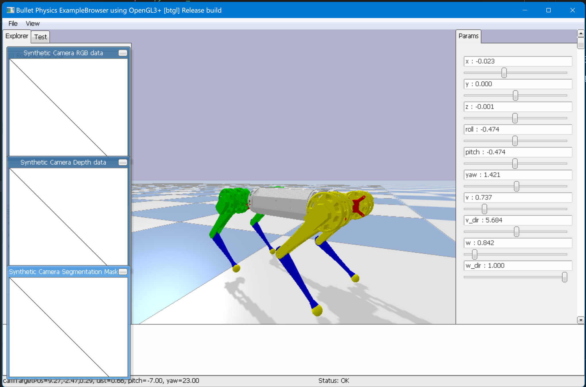

# Quadfly 四足机器狗

## 仓库说明

这些是之前业余学习四足机器狗的一些研究成果，包括仿真代码，文档，笔记等，做个记录。
要看懂需要先学习机器人相关的一些知识以及机器人数学等。

- `Core` 目录是运行在 pybullet 环境，四足狗仿真代码 `quadfly.py` 的核心实现，实现了步态发生器、运动学约束、机器人数学库等逻辑；运行需要先配置 pybullet 环境。
- 运动学基本原理在 `doc` 目录下，笔记和书籍 《MODERN ROBOTICS MECHANICS, PLANNING, AND CONTROL》，这本书采用不同于传统的 DH 建模法，而是使用旋量数学建模，更易懂，数学上处理简单。
- 其他的 py 文件都是一些算法验证、模拟测试逻辑，直接就能运行。

> 实现的不完善，具体可以尝试配置运行体验
> 整体设计可以查看文档 `FirstRead.md`

