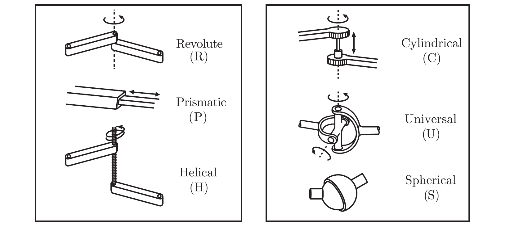
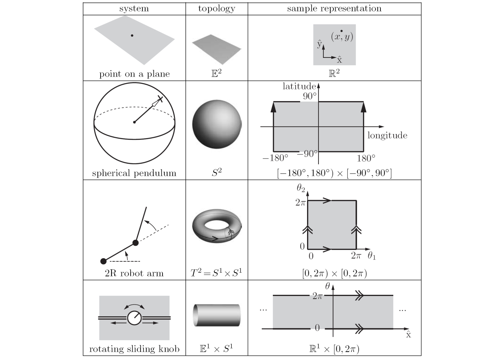
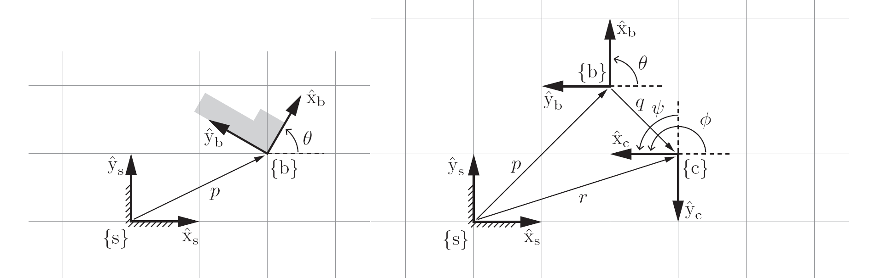
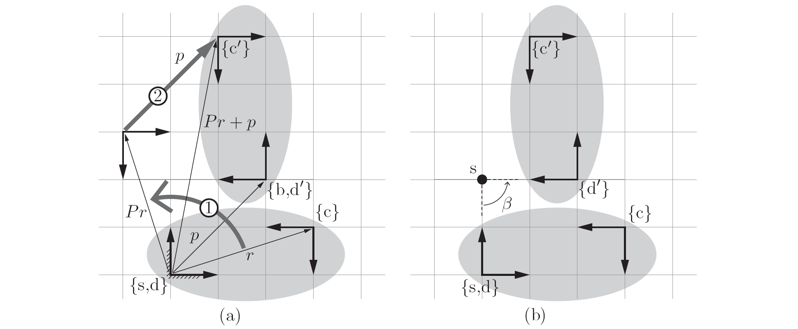
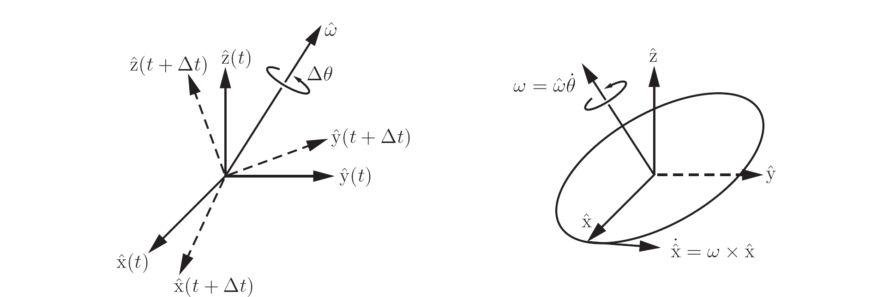
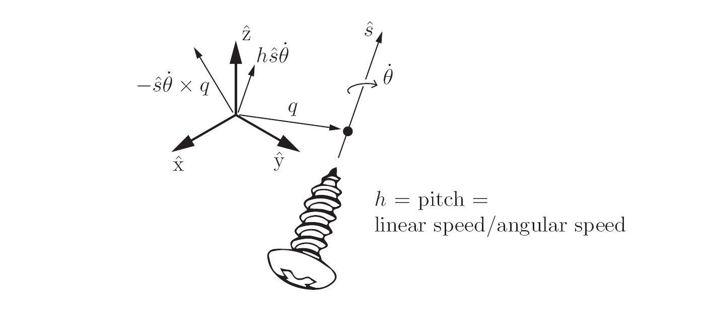
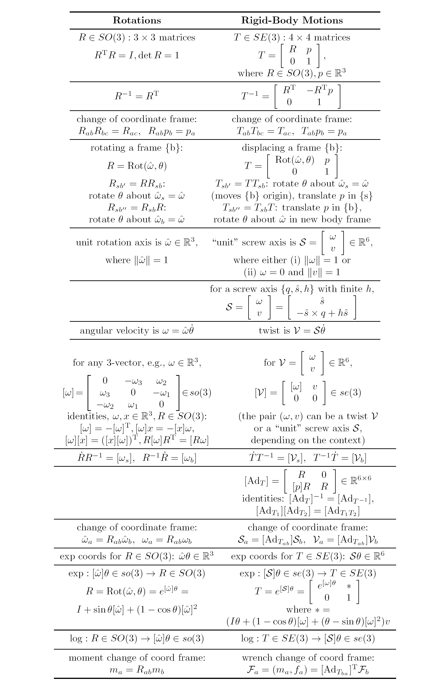

# Modern Robotics Mechanics, Planning, and Control

## __Basic math__

$\det M^{3 \times 3}=a^T(b\times c)=b^T(c\times a)=c^T(a\times b)$, $a,b,c$ are column vectors of $M$

$$\sin \theta=\theta - \frac{\theta^3}{3!}+\frac{\theta^5}{5!} - \cdots$$
$$\cos \theta=1 - \frac{\theta^2}{2!}+\frac{\theta^4}{4!} - \cdots$$

__Essential Results from Linear Differential Equations Theory__

- scalar linear differential equation $x(t),a \in \Bbb{R}$

  $\dot{x}(t) = ax(t)$ has solution $x(t)=e^{at}x(0)$, and 
  $$e^{at}=1+at+\frac{(at)^2}{2!}+\frac{(at)^3}{3!}+\cdots$$

- vector linear differential equation $x(t) \in \Bbb{R^n}, A \in \Bbb{R^{n\times n}}$

  $\dot{x(t)} = Ax(t)$ has solution $x(t)=e^{At}x(0)$, and matrix exponential
  $$e^{At}=I+At+\frac{(At)^2}{2!}+\frac{(At)^3}{3!}+\cdots$$
  
$e^{At}$ satisifies the following properties
- $\frac{d}{dt}e^{At}=Ae^{At}=e^{At}A$
- If $A = PDP^{-1}$ for some $D \in \Bbb{R^{n \times n}}$ and invertible $P \in \Bbb{R^{n \times n}}$, then $e^{At}=Pe^{Dt}P^{-1}$
- If $AB = BA$ then $e^Ae^B = e^{A+B}$
- $(e^A)^{-1} = e^{-A}$.

---

**special orthogonal group SO(3)**  is the set of all $3 \times 3$ real matrices $R$ that satisfy 
$$R^T R = I$$
$$\det R = 1$$

also known as the group of rotation matrices.

**special orthogonal group SO(2)** is the set of all $2 \times 2$ real matrices $R$ that satisfy 
$$R^T R = I$$
$$\det R = 1$$

a subgroup of **SO(3)**.

> More specifically, the **SO(n)** groups are also called **matrix Lie groups** because the elements of the group form a difierentiable manifold（微分流形）.

**properties**

for all $A$ $B$ in the group the following properties are satisfied:
- **closure**: $AB$ is also in the group.
- **associativity**: $(AB)C = A(BC)$.
- **identity element existence**: There exists an element $I$ in the group (the identity matrix for **SO(n)**) such that $AI = IA = A$.
- **inverse element existence**: There exists an element $A^{-1}$ in the group such that $AA^{-1} = A^{-1}A = I$.

---

**special Euclidean group SE(3)** is the set of all $4 \times 4$ real matrices $T$ of the form
$$T=\begin{bmatrix} R & p \\ 0 & 1 \end{bmatrix}$$

as the group of rigid-body motions or homogeneous transformation matrices in $\Bbb{R^3}$, where $R \in SO(3)$ and $p \in \Bbb{R^3}$ is a column vector.

**special Euclidean group SE(2)** is the set of all $3 \times 3$ real matrices $T$ of the form
$$\begin{aligned}
  T&=\begin{bmatrix}R & p \\ 0 & 1\end{bmatrix}\\
  &=\begin{bmatrix}
    \cos \theta & -\sin \theta & p_1\\
    \sin \theta & \cos \theta & p_2 \\
    0 & 0 & 1
  \end{bmatrix}
\end{aligned}$$
where $R \in SO(2)$ and $p \in \Bbb{R^2}$ is a column vector.

**properties**

$$T^{-1}=\begin{bmatrix}R^T & -R^T p \\ 0 & 1\end{bmatrix}$$

---

Given a vector $\omega=[\omega_1, \omega_2, \omega_3]^T \in \Bbb{R^3}$, the matrix representation of $\omega$ is
$$[\omega]=\begin{bmatrix}0 & -\omega_3 & \omega_2 \\\omega_3 & 0 & -\omega_1 \\-\omega_2 & \omega_1 & 0\end{bmatrix} \in so(3)$$

The set of all $3\times 3$ real skew-symmetric matrices is called **so(3)**.

**so(3)** is called the **Lie algebra of the Lie group SO(3)**. It consists of all possible $\dot{R}$ when $R = I$.

Given any $\omega \in \Bbb{R^3}$ and $R \in SO(3)$ the following always holds:
$$R[\omega]R^T=[R\omega]$$
$$[\hat{\omega}]^3=-[\hat{\omega}]$$
$$[\omega]=-[\omega]^T$$
---

Given a twists $\mathcal{V}=(\omega, v) \in \Bbb{R^6}$, where $[\omega] \in so(3)$ and $v \in \Bbb{R^3}$, the matrix representation of $\mathcal{V}$ is

$$[\mathcal{V}]=\begin{bmatrix}[\omega] & v \\0 & 0\end{bmatrix} \in se(3)$$

The set of all $4 \times 4$ matrices of this form is called **se(3)**, and comprises the matrix representations of the twists associated with the rigid-body configurations **SE(3)**.

**se(3)** is called the **Lie algebra of the Lie group SE(3)**. It consists of all possible $\dot{T}$ when $T = I$.

---

Given $T = (R, p) \in SE(3)$, its **adjoint representation** $[Ad_T]$ is
$$[Ad_T]=\begin{bmatrix}R & 0 \\ [p]R & R \end{bmatrix} \in \Bbb{R^{6 \times 6}}$$

For any $\mathcal{V} \in \Bbb{R^6}$, the **adjoint map** associated with $T$ is
$$\mathcal{V}'=[Ad_T]\mathcal{V}=Ad_T(\mathcal{V})$$

Let $T_1$, $T_2$ $\in SE(3)$ and $\mathcal{V}=(\omega, v)$. Then
$$[Ad_{T_1}][Ad_{T_2}]\mathcal{V}=[Ad_{T_1 T_2}]\mathcal{V}$$

For any $T \in SE(3)$ the following holds:
$$[Ad_T]^{-1}=[Ad_{T^{-1}}]$$

In terms of the matrix form $[\mathcal{V}] \in se(3)$ of $\mathcal{V} \in \Bbb{R^6}$
$$[\mathcal{V}']=T[\mathcal{V}]T^{-1}$$

 

## 
__Configuration Space__

links, joints, actuators, end-effector

1. The **configuration** of a robot is a complete specification of the position of every point of the robot (机器人所有点位置的描述)
2. The minimum number n of real-valued *(continuous range)* coordinates needed to represent the configuration is the number of **degrees of freedom (dof)** of the robot
3. The n-dimensional space containing all possible configurations of the robot is called the **configuration space (C-space)**.
4. The configuration of a robot is represented by a point in its **C-space**

The configuration of a rigid body is a specification of the location of all its points.

The configuration of a robot is a specification of the configuration of all its links.

 

### __Degrees of Freedom of a Rigid Body__

- planar rigid body (二维空间中的刚体, 3 DOF)
- spatial rigid body (三维空间中的刚体, 6 DOF)

dof = (sum of freedoms of the bodies) - (number of *independent* constraints)

 

### __Degrees of Freedom of a Robot__

**Grubler's formula**, for determining the number of degrees of freedom of planar and spatial robots

 

#### __Robot Joints__

- revolute joint (R) / hinge joint
- prismatic joint (P) / sliding or linear joint
- helical joint (H) / screw joint
- cylindrical joint (C)
- universal joint (U)
- spherical joint (S) / ball-and-socket joint / shoulder joint

> Every joint connects exactly two links; joints that simultaneously connect three or more links are not allowed
>
> A joint can be viewed as providing freedoms to allow one rigid body to move relative to another
>
> It can also be viewed as providing constraints on the possible motions of the two rigid bodies it connects

> Generalizing, the number of degrees of freedom of a rigid body minus the number of constraints provided by a joint must equal the number of freedoms provided by that joint
> 
> | Joint type | dof f | Constraints c between two planar rigid bodies | Constraints c between two planar rigid bodies |
> | --- | --- | --- | --- |
> |Revolute (R) | 1 | 2 | 5 |
> |Prismatic (P) | 1 | 2 | 5 |
> |Helical (H) | 1 | N/A | 5 |
> |Cylindrical (C) | 2 | N/A | 4 |
> |Universal (U) | 2 | N/A | 4 |
> |Spherical (S) | 3 | N/A | 3 |

 

#### __Grubler's formula__

> This formula holds in "generic" cases, but it fails under certain configurations of the links and joints, such as when the joint constraints are not independent.
>
> A joint by definition connects exactly two links, the joint at this point of intersection should not be regarded as a single revolute joint

- a mechanism consisting of $N$ links (ground is also regarded as a link)
- $J$ be the number of joints
- $m$ be the number of degrees of freedom of a rigid body ($m = 3$ for planar mechanisms and $m = 6$ for spatial mechanisms)
- $f_i$ be the number of freedoms provided by joint $i$
- $c_i$ be the number of constraints provided by joint $i$
- $f_i + c_i = m$ for all $i$

$$dof = m(N-1) - \sum_{i=1}^{J}c_i$$
$$=m(N-1) -\sum_{i=1}^{J}(m-f_i)$$
$$=m(N- 1 - J) + \sum_{i=1}^{J}f_i$$

- open-chain mechanisms (serial mechanisms)
- closed-chain mechanisms (A closed-chain mechanism is any mechanism that has a closed loop)

 

### __Configuration Space: Topology and Representation__

C-space shape

#### __Configuration Space Topology__

The idea that the two-dimensional surfaces of a small sphere, a large sphere, and a football all have the same kind of **shape**, which is different from the shape of a plane, is expressed by the **topology** of the surfaces

The topology of a space is a fundamental property of the space itself and is independent of how we choose coordinates to represent points in the space

Two spaces are **topologically equivalent** if one can be *continuously deformed* into the other *without cutting or gluing*

Topologically distinct one-dimensional spaces include the circle, the line, and a closed interval of the line

- circle is written mathematically as $S$ or $S^1$ (a one-dimensional "sphere")
- line $\Bbb E$ or $\Bbb E^1$ (a one-dimensional Euclidean (or "flat") space)
- point $\Bbb R$ or $\Bbb R^1$
- a closed interval of the line $[a, b] \subset \Bbb R^1$
- a open interval $(a, b)$ as line

high dimensional

- $\Bbb R^n$ is the n-dimensional Euclidean space
- $S^n$ is the n-dimensional surface of a sphere in $(n + 1)$-dimensional space

Some C-spaces can be expressed as the **Cartesian product** of two or more spaces of lower dimension;
that is, points in such a C-space can be represented as the union of the representations of points in the lower-dimensional spaces

$T^n$ is the n-dimensional surface of a torus(环) in an $(n+1)$-dimensional space,$T^n = S^1 \times S^1 \cdots  \times S^1$ ($n$ copies of $S^1$)

C-spaces of a rigid body can be described by a point in $R^3$, plus a point on a two-dimensional sphere $S^2$,plus a point on a one-dimensional circle $S^1$, giving a total C-space of $R^3 \times S^2 \times S^1$

 

#### __Configuration Space Representation__

A choice of $n$ coordinates, or parameters, to represent an $n$-dimensional space is called an **explicit parametrization of the space**.

> The latitude-longitude representation of a sphere is unsatisfactory if you are walking near the North Pole (where the latitude equals 90) or South Pole (where the latitude equals -90), where taking a very small step can result in a large change in the coordinates.
>
> The North and South Poles are **singularities** of the representation, and the existence of singularities is a result of the fact that a sphere does not have the same topology as a plane.
>
> Singularities of the parametrization are particularly problematic when representing velocities as the time rate of change of coordinates, since these representations may tend to infinity near singularities even if the point on the sphere is moving at a constant speed.

An **implicit representation** views the $n$-dimensional space as embedded in a Euclidean space of more than $n$ dimensions

_Disadvantage_

1. The representation has more numbers than the number of degrees of freedom.

_Advantage_

1. There are no singularities in the representation
2. It may be very difficult to construct an explicit parametrization

> An implicit representation uses the coordinates of the higher-dimensional space but subjects these coordinates to constraints that reduce the number of degrees of freedom
>
> two-dimensional unit sphere can be viewed as a surface embedded in a three-dimensional Euclidean space
>
> $(x, y, z)$ in the three-dimensional space, $x^2 + y^2 + z^2 = 1$ for the unit sphere
>
> the non-Euclidean shape of many C-spaces motivates our use of implicit representations of C-space

 

### __Configuration and Velocity Constraints__

For general robots containing one or more *closed loops*, the configuration space can be implicitly represented by

- the column vector $\theta=[\theta_1 \cdots \theta_n]^T \in \Bbb R^n$
- *loop-closure equations* of the form ($k$ independent equations, $k \leq n$)
  
  $$g(\theta)=
  \begin{bmatrix}
    g_1(\theta_1, \cdots ,\theta_n) \\ \vdots \\ g_k(\theta_1, \cdots ,\theta_n)

  \end{bmatrix}=0 \Rightarrow g: \Bbb R^n \rightarrow \Bbb R^k$$

Such constraints are known as **holonomic constraints**（完整约束）, ones that reduce the dimension of the C-space. And the C-space can be viewed as a surface of dimension $n - k$ (assuming that all constraints are independent) embedded in $R^n$

- in motion, following the time trajectory $\theta(t)$
- joint-velocity vector $\dot{\theta_i}$

Diffierentiating both sides of $g(\theta(t)) = 0$ with respect to $t$
$$\frac{\rm d}{{\rm d} t}g(\theta(t))=0$$
$$\begin{bmatrix}
  \frac{\partial{g_1(\theta)}}{\partial{\theta_1}} & \cdots & \frac{\partial{g_1(\theta)}}{\partial{\theta_n}} \\
  \vdots & \ddots & \vdots \\
  \frac{\partial{g_k(\theta)}}{\partial{\theta_1}} & \cdots & \frac{\partial{g_k(\theta)}}{\partial{\theta_n}}
\end{bmatrix}
\begin{bmatrix}
  \dot {\theta_1} \\ \vdots \\  \dot {\theta_n}
\end{bmatrix}=0$$
$$\Rightarrow \frac{\partial{g(\theta)}}{\partial{\theta}} \dot{\theta}=0, \text{ where }\frac{\partial{g(\theta)}}{\partial{\theta}} \in \Bbb R^{k \times n}$$

holonomic constraints of the form $g(\theta) = 0$ are also called **Integrable constraints** because the velocity constraints that they imply can be integrated to give equivalent configuration constraints

 

A robot's motion can also be subject to velocity constraints of the form
$$A(\theta)\dot{\theta}=0 \text{, where } A(\theta) \in \Bbb R^{k \times n}$$

where $A(\theta)$ is a $k \times n$ matrix that cannot be expressed as the diffierential of some function $g(\theta)$. Such constraints are said to be **nonholonomic constraints**（非完整约束）, or **nonintegrable constraints**. These constraints reduce the dimension of the feasible(可行) velocities of the system but do not reduce the dimension of the reachable C-space.

Velocity constraints of this form are called **Pfaffian constraints**

> In a number of robotics contexts nonholonomic constraints arise that involve the conservation of momentum and rolling without slipping(在一些机器人环境中，出现了非完整约束，这些约束涉及保持动量和滚动而不滑倒)

 

### __Task Space and Workspace__

Both relate to the configuration of the end-effector of a robot, not to the configuration of the entire robot

The **task space** is a space in which the robot's task can be naturally expressed.
> The decision of how to define the task space is driven by the task, independently of the robot

The **workspace** is a specification of the configurations that the end-effector of the robot can reach.
> The definition of the workspace is primarily driven by the robot's structure, independently of the task

The task space and the workspace are distinct from the robot's C-space.

- A point in the task space or the workspace may be achievable by more than one robot configuration, meaning that the point is not a full specification of the robot's configuration.
- Some points in the task space may not be reachable at all by the robot
- All points in the workspace are reachable by at least one configuration of the robot
- Two mechanisms with diffierent C-spaces may have the same workspace
- Two mechanisms with the same C-space may also have diffierent workspaces

 

## 
__Rigid-Body Motions__

### __Vectors and Reference Frames__
> fixed frame or space frame $\{s\}$, body frame $\{b\}$.
> 
> free vector：a geometric quantity with a length and a direction, no root (i.e. linear velocity), coordinate free.
> 
> reference vector：a free vector be represented by its coordinates in the reference frame (can change by refer to different frame but it's free vector is unchanged).
> 
> point has the same attributes.
> 

> $\hat{x}$, $\hat{y}$, $\hat{z}$ unit axes of a right-handed reference frame are aligned with the index finger, middle finger, and thumb of the right hand, respectively.
> 
> A positive rotation about an axis is in the direction in which the fingers of the right hand curl when the thumb is pointed along the axis.
> 
> A $4\times4$ matrix:
> 
> 1. The configuration of this frame with respect to a fixed reference frame is then represented as a $4\times4$ matrix (an implicit representation of the C-space : $16$-dimensional space and $10$ constraints).
> 2. Translate and rotate a vector or a frame.
> 3. Change the representation of a vector or a frame from coordinates in one frame to coordinates in another frame.
> 
> The non-Euclidean (i.e., "non-flat") nature of the C-space of positions and orientations leads us to use a matrix representation.

### __Rotation Matrix__ ###

$$\begin{aligned}
  \begin{bmatrix}
    X_s \\ Y_s \\ Z_s
  \end{bmatrix}&=
  \begin{bmatrix}
    \hat{I} \\ \hat{J} \\ \hat{K}
  \end{bmatrix} \vec{v}\\
  &=\begin{bmatrix}
    \hat{I} \\ \hat{J} \\ \hat{K}
  \end{bmatrix} \begin{bmatrix}
    \hat{i} & \hat{j} & \hat{k}
  \end{bmatrix} \begin{bmatrix}
    x_b \\ y_b \\ z_b
  \end{bmatrix}\\
  &=R \begin{bmatrix}
    x_b \\ y_b \\ z_b
  \end{bmatrix}
\end{aligned}$$

 

### __Rigid-Body Motions in the Plane__

$(P, p)$ rotation matrix-vector pair, $P \in \Bbb{R^{2 \times 2}}$ is a rotation matrix and $p \in \Bbb{R^2}$ is orign vector about reference frame.

a rotation matrix-vector pair can be used for three purposes:

1. to represent a configuration of a rigid body in $\{s\}$.
2. to change the reference frame in which a vector or frame is represented.
3. to displace a vector or a frame.

To describe the configuration of the planar body, only the *position* and *orientation* of the body frame with respect to the fixed frame need to be specified.

Expressing $\{b\}$ in $\{s\}$ as pair $(P, p)$

$$p=\begin{bmatrix} p_x \\ p_y \end{bmatrix}, P=\begin{bmatrix} \hat{x_b} & \hat{y_b} \end{bmatrix}=
\begin{bmatrix}
  \cos \theta  & -\sin \theta \\ \sin \theta & \cos \theta
\end{bmatrix}$$

Expressing $\{c\}$ in $\{s\}$ as pair $(R, r)$

$$r=\begin{bmatrix} r_x \\ r_y \end{bmatrix}, R=\begin{bmatrix} \hat{x_c} & \hat{y_c} \end{bmatrix}=
\begin{bmatrix}
  \cos \phi  & -\sin \phi \\ \sin \phi & \cos \phi
\end{bmatrix}$$

Expressing $\{c\}$ in $\{b\}$ as pair $(Q, q)$

$$q=\begin{bmatrix} q_x \\ q_y \end{bmatrix}, Q=\begin{bmatrix} \hat{x_b} & \hat{y_b} \end{bmatrix}=
\begin{bmatrix}
  \cos \psi  & -\sin \psi \\ \sin \psi & \cos \psi
\end{bmatrix}$$

We can compute the configuration of $\{c\}$ relative to $\{s\}$ as follows (convert the representation of a point or frame from $\{b\}$ coordinates to $\{s\}$ coordinates.)

$$R=PQ$$
$$r=Pq + p$$

Figure: *a rigid body with two frames attached to it, $\{d\}$ and $\{c\}$, The frame $\{d\}$ is initially coincident with $\{s\}$, and $\{c\}$ is initially described by $(R, r)$ in $\{s\}$.Then the body is moved in such a way that $\{d\}$ moves to $\{d'\}$, becoming coincident with a frame $\{b\}$ described by $(P, p)$ in $\{s\}$*.

Denoting the configuration of the new frame $\{c'\}$ as $(R', r')$, so 
$$R' = PR$$
$$r' = Pr + p$$
$(P, p)$ is expressed in the same frame as $(R, r)$, so the equations are not viewed as a change of coordinates but as a **rigid-body displacement** or **rigid-body motion**.

 

### __Rotations and Angular Velocities__

#### __Uses of Rotation Matrices__

- Representing an orientation (*as representing a frame*)

  $R_c$ or $R_{sc}$ refer to the orientation of frame $\{c\}$ relative to the fixed frame $\{s\}$. (If there is no possibility of confusion regarding the frames involved, we may simply write $R$)

  for any two frames  $\{d\}$, $\{e\}$
  $$R_{de}=R_{ed}^{-1}=R_{ed}^T$$

- Changing the reference frame (*as an operator*)

  The rotation matrix $R_{ab}$ represents the orientation of $\{b\}$ in $\{a\}$, $R_{bc}$ represents the orientation of $\{c\}$ in $\{b\}$, the orientation of $\{c\}$ in $\{a\}$ can be computed as

  $$R_{ac}=R_{ab} R_{bc}$$
  $$p_a=R_{ab} p_b$$

  $R_{ab}$ can be viewed as a *mathematical operator* that changes the reference frame from $\{b\}$ to $\{a\}$

- Rotating a vector or a frame (*as an operator*)
  
  $R_{ab}$ representing the rotation operation that takes $\{a\}$ to $\{b\}$

  $R$ as a rotation operator, meaning the operation that rotates the orientation represented by the identity matrix to the orientation represented by R
  $$R=Rot(\hat{\omega}, \theta)=Rot(-\hat{\omega}, -\theta)$$

  - $RR_{sb}$ premultiplying by $R$ yields a rotation about an axis $\hat{\omega}$ considered to be in the fixed frame.
  - $R_{sb}R$ postmultiplying by $R$ yields a rotation about $\hat{\omega}$ considered as being in the body frame.
  - $Rv$ yields a rotation about an axis $\hat{\omega}$ considered to be in the $v$ frame.

 

#### __Angular Velocities__

$$\omega = \hat{\omega} \dot{\theta}$$

$R(t)$ be the rotation matrix describing the orientation of the body frame with respect to the fixed frame at time $t$.

$r_i$ is cloumn of $R(t)$, and $i=1,2,3$
$$\dot{r_i}=\omega_s \times r_i$$

$$\begin{aligned}
  \dot{R}&=\begin{bmatrix}
  \dot{r_1} & \dot{r_2} & \dot{r_3}
\end{bmatrix} \\ 
&= \omega_s \times R \\
&=[\omega_s]R
\end{aligned}$$
$$\begin{aligned}
  [\omega_s]&=\dot{R}R^{-1}\\
  &=\dot{R}R^T
\end{aligned}$$

obtain $\omega_b$ from $\omega_s$, given $\omega_s=R_{sb} \omega_b$

$$\begin{aligned}
  \omega_b&=R_{sb}^{-1} \omega_s\\
  &=R^{-1}\omega_s\\
  &=R^T\omega_s
\end{aligned}$$
$$\begin{aligned}
  [\omega_b]&=[R^T\omega_s]\\
  &=R^T[\omega_s]R\\
  &=R^T(\dot{R}R^T)R\\
  &=R^T\dot{R}\\
  &=R^{-1}\dot{R}
\end{aligned}$$

It is important to note that $\omega_b$ is not the angular velocity relative to a moving frame, $\omega_b$ is the angular velocity relative to the *stationary frame*（静止坐标系）$\{b\}$ that is instantaneously（瞬时）coincident with a frame attached to the moving body.

It is also important to note that the fixed-frame angular velocity $\omega_s$ does not depend on the choice of body frame, the body-frame angular velocity $\omega_b$ does not depend on the choice of fixed frame.

 

#### __Exponential Coordinate Representation of Rotation__

axis-angle representation of a rotation : $(\hat{\omega}, \theta )$

The exponential coordinates of a rotation $\hat{\omega}\theta \in \Bbb{R^3}$ can be viewed equivalently as

1. a unit axis of rotation $\hat{\omega} \in \Bbb{R^3}$ together with a rotation angle about the axis $\theta \in \Bbb{R}$
2. the 3-vector obtained by multiplying the two together $\hat{\omega}\theta \in \Bbb{R^3}$

> Singularities such as this are unavoidable for any three-parameter representation of rotation. Euler angles and roll-pitch-yaw angles suffer from similar singularities

 

Define a matrix exponential (exp) and matrix logarithm (log):

$$\exp: [\hat{\omega}]\theta \in so(3) \rightarrow R \in SO(3)$$
$$\log: R \in SO(3) \rightarrow [\hat{\omega}]\theta \in so(3)$$

__Matrix Exponential of Rotations__

Given a vector $\hat{\omega}\theta \in \Bbb{R^3}$, such that $\theta$ is any scalar and $\hat{\omega} \in \Bbb{R^3}$ is a unit vector, the matrix exponential of $[\hat{\omega}]\theta=[\hat{\omega}\theta] \in so(3)$ is
$$\begin{aligned}
  Rot(\hat{\omega}, \theta)&=e^{[\hat{\omega}]\theta}\\
  &=I+\sin \theta [\hat{\omega}] + (1-\cos \theta) [\hat{\omega}]^2\\
  & \in SO(3)
\end{aligned}$$

This is **Rodrigues' formula for rotations**.

__Matrix Logarithm of Rotations__

Given $R \in SO(3)$, find a $\theta \in [0, \pi]$ and a unit rotation axis $\hat{\omega} \in \Bbb{R^3}$ such that $e^{[\hat{\omega}]\theta}=R$.

The vector $\hat{\omega}\theta \in \Bbb{R^3}$ comprises the exponential coordinates for $R$ and the skew-symmetric matrix $[\hat{\omega}]\theta \in so(3)$ is the matrix logarithm of $R$.

1. If $R=I$ then $\theta=0$ and $\hat{\omega}$ is undefined.
2. If $tr R=-1$ then $\theta=\pi$. Set $\hat{\omega}$ equal to any of the following three vectors that is a feasible solution: (if $\hat{\omega}$ is a solution, then so is $-\hat{\omega}$)

  $$\hat{\omega}=\frac{1}{\sqrt{2(1+r_{33})}}\begin{bmatrix}
    r_{13} \\ r_{23} \\ 1+r_{33}
  \end{bmatrix}$$
  $$\hat{\omega}=\frac{1}{\sqrt{2(1+r_{22})}}\begin{bmatrix}
    r_{12} \\ 1+r_{22} \\ r_{32}
  \end{bmatrix}$$
  $$\hat{\omega}=\frac{1}{\sqrt{2(1+r_{11})}}\begin{bmatrix}
    1+r_{11} \\ r_{21} \\ r_{31}
  \end{bmatrix}$$
3. Otherwise $\theta=\arccos (\frac{1}{2}(tr R -1)) \in (0, \pi)$ and
  $$[\hat{\omega}]=\frac{1}{2\sin \theta}(R-R^T)$$

Since every $R \in SO(3)$ satisfies one of the three cases in the algorithm, for every $R$ there exists a matrix logarithm $[\hat{\omega}]\theta$ and therefore a set of exponential coordinates $\hat{\omega}\theta$.

---
 

### __Rigid-Body Motions and Twists__

From the **Chasles-Mozzi theorem** states that every rigid-body displacement can be obtained by a finite rotation and translation about a fixed screw axis.

#### __Screw motion__ （螺旋运动）

Use the **exponential coordinates** (指数坐标, a $6$-parameter representation of the configuration) for the rigid-body displacement obtained by rotating about the screw axis $S = (\hat{\omega},v)$ by an angle $\theta$. 

- represent the displacement using the three coordinates $S\theta = (\hat{\omega} \theta, v \theta)$ or just $S\theta$.

- consider it as the displacement obtained by following simultaneous angular and linear velocities $V=S \dot{\theta}$ (rotation speed $\dot{\theta}$) for a given distance

The displacement obtained by rotating about the screw axis $S$ by an angle $\theta$ is equivalent to the displacement obtained by rotating about $S$ at a speed $\dot{\theta}=\theta$ for unit time.

 

#### __Homogeneous Transformation Matrices__

There are three major uses for a transformation matrix $T$ :

1. to represent the configuration (position and orientation) of a rigid body
2. to change the reference frame in which a vector or frame is represented
3. to displace a vector or frame

A transformation matrix $T$, viewed as the pair $(R, p) = (Rot(\hat{\omega}, \theta)), p)$ where
$$Rot(\hat{\omega}, \theta)=\begin{bmatrix}R & 0 \\ 0 & 1\end{bmatrix}$$
$$Trans(p)=\begin{bmatrix}I & p \\ 0 & 1\end{bmatrix}$$

In the fixed frame $\{s\}$
$$T_{sb'}=TT_{sb}=Trans(p)Rot(\hat{\omega},\theta)T_{sb}=
\begin{bmatrix}RR_{sb} & Rp_{sb}+p \\ 0 & 1\end{bmatrix}$$

In the body frame $\{b\}$
$$T_{sb''}=T_{sb}T=T_{sb}Trans(p)Rot(\hat{\omega},\theta)=
\begin{bmatrix}R_{sb}R & R_{sb}p+p_{sb} \\ 0 & 1\end{bmatrix}$$

#### __Twists__

Given a fixed (space) frame $\{s\}$, a body frame $\{b\}$, and a differentiable $T_{sb}(t) \in SE(3)$, where $T_{sb}(t)=\begin{bmatrix}R(t) & p(t) \\ 0 & 1\end{bmatrix}$, then

$$\dot{T_{sb}} T_{sb}^{-1}=\begin{bmatrix}\dot{R} R^T & \dot{p}-\dot{R} R^T p \\ 0 & 0 \end{bmatrix}=\begin{bmatrix}[\omega_s] & v_s \\0 & 0\end{bmatrix}=[V_s] \in se(3)$$
is the matrix representation of the **spatial twist** (spatial velocity in the space frame).

$$T_{sb}^{-1} \dot{T_{sb}}=\begin{bmatrix}R^T \dot{R} & R^T \dot{p} \\ 0 & 0 \end{bmatrix}=\begin{bmatrix}[\omega_b] & v_b \\0 & 0\end{bmatrix}=[V_b] \in se(3)$$
is the matrix representation of the **body twist** (spatial velocity in the body frame).

$$[V_s]=T[V_b]T^{-1}$$
$$[V_b]=T^{-1}[V_s]T$$

The twists $V_b$, $V_s$ 
$$V_s=\begin{bmatrix}\omega_s \\ v_s \end{bmatrix}=[Ad_{T_{sb}}]V_b=\begin{bmatrix}R & 0 \\ [p]R & R \end{bmatrix}\begin{bmatrix}\omega_b \\ v_b \end{bmatrix}$$
$$V_b=\begin{bmatrix}\omega_b \\ v_b \end{bmatrix}=[Ad_{T_{bs}}]V_s=\begin{bmatrix}R^T & 0 \\ -R^T[p] & R^T \end{bmatrix}\begin{bmatrix}\omega_s \\ v_s \end{bmatrix}$$

For a given twist, its fixed-frame representation $V_s$ does not depend on the choice of the body frame $\{b\}$, and its body-frame representation $V_b$ does not depend on the choice of the fixed frame $\{s\}$.

__Physical interpretation__

If we regard the moving body as being _infinitely large_

- $\omega_b$ is the angular velocity expressed in $\{b\}$, and $\omega_s$ is the angular velocity expressed in $\{s\}$
- $v_b$ is the linear velocity of a point at the origin of $\{b\}$ expressed in $\{b\}$, and $v_s$ is the linear velocity of a point at the origin of $\{s\}$ expressed in $\{s\}$

__The Screw Interpretation of a Twist__

Just as an angular velocity $\omega$ can be viewed as $\hat{\omega} \dot{\theta}$, where $\hat{\omega}$ is the unit rotation axis and $\dot{\theta}$ is the rate of rotation about that axis, a twist $V$ can be interpreted in terms of a **screw axis** $S$ and a velocity $\dot{\theta}$ about the screw axis.

A screw axis represents the familiar motion of a screw: rotating about the axis while also translating along the axis.

- One representation of a screw axis $S$ is $\{q, \hat{s}, h\}$, where $q \in \Bbb{R^3}$ is any point on the axis, $\hat{s}$ is a unit vector in the direction of the axis, and $h$ is the **screw pitch**, which defines the ratio of the linear velocity along the screw axis to the angular velocity $\dot{\theta}$ about the screw axis.

  $V$ is a general twist

  $$V=\begin{bmatrix}\omega \\ v \end{bmatrix}=\begin{bmatrix}\hat{s}\dot{\theta} \\ -\hat{s}\dot{\theta} \times q + h\hat{s}\dot{\theta} \end{bmatrix}$$

  $h = 0$ for a pure rotation about the screw axis
  
  $\omega=0$ the pitch of the screw is infinite and the twist is a translation along the axis defined by $v$

- Another representation of a screw axis $S$ (**a normalized twist**)

  For a given reference frame, a screw axis $S$ is written as
  $$S=\begin{bmatrix}\omega \\ v \end{bmatrix} \in \Bbb{R^6}$$
  where either

  1. $\|\omega\|=1$, *(also $S=\frac{V}{\|\omega\|}$, normalized by the length of the angular velocity vector)*
  2. $\omega=0$ and $\|v\|=1$, *(also $S=\frac{V}{\|v\|}$, normalized by the length of the linear velocity vector)*

__Exponential Coordinate Representation of Rigid-Body Motions__

The __Chasles-Mozzi theorem__ states that every rigid-body displacement can be expressed as a displacement along a fixed screw axis $S$ in space.

Define the six-dimensional exponential coordinates of a homogeneous transformation $T$ as $S\theta \in \Bbb{R^6}$, where $S$ is the screw axis and $\theta$ is the distance that must be traveled along the screw axis to take a frame from the origin $I$ to $T$.

- If the pitch of the screw axis $S=(\omega, v)$ is finite then $\|\omega\| = 1$ and $\theta$ corresponds to the angle of rotation about the screw axis. 
- If the pitch of the screw is infinite then $\omega=0$ and $\|v\|=1$ and $\theta$ corresponds to the linear distance traveled along the screw axis.

 

Define a matrix exponential (exp) and matrix logarithm (log):

$$\exp: [S]\theta \in se(3) \rightarrow T \in SE(3)$$
$$\log: T \in SE(3) \rightarrow [S]\theta \in se(3)$$

__Matrix Exponential of Rigid-Body Motions__

Let $S=(\omega, v)$ be a screw axis:

- If $\|\omega\|=1$, then for any distance $\theta \in \Bbb{R}$ traveled along the axis

  $$e^{[S]\theta}=\begin{bmatrix}
    e^{[\omega]\theta} & G(\theta)v \\
    0 & 1
  \end{bmatrix}$$
  $$G(\theta)=I\theta+(1-\cos \theta )[\omega] + (\theta - \sin \theta)[\omega]^2$$
- If $\omega=0$ and $\|v\|=1$, then
  
  $$e^{[S]\theta}=\begin{bmatrix}I & v\theta \\ 0 & 1\end{bmatrix}$$

__Matrix Logarithm of Rigid-Body Motions__

Given an arbitrary $T=(R, p) \in SE(3)$, one can always find a screw axis $S=(\omega, v)$ and a scalar $\theta$ such that
$$e^{[S]\theta}=\begin{bmatrix}R & p \\ 0 & 1\end{bmatrix}$$

Given $T=(R, p) \in SE(3)$, find a $\theta \in [0, \pi]$ and a screw axis $S=(\omega, v) \in\Bbb{R^6}$ (where at least one of $\|\omega\|$ and $\|v\|$ is unity) such that $e^{[S]\theta}=T$. The vector $S\theta \in \Bbb{R^6}$ comprises the exponential coordinates for $T$ and the matrix $[S]\theta \in se(3)$ is the matrix logarithm of $T$

1. If $R=I$ then set $\omega=0$, $v=\frac{p}{\|p\|}$, and $\theta=\|p\|$
2. Otherwise, use the matrix logarithm on $SO(3)$ to determine $\omega$ and $\theta$ for R. Then $v$ is calculated as
  
  $$v=G(\theta)^{-1}p$$
  $$G(\theta)^{-1}=\frac{1}{\theta}I-\frac{1}{2}[\omega]+(\frac{1}{\theta}-\frac{1}{2}\cot \frac{\theta}{2})[\omega]^2$$

For planar rigid-body motions, a planar matrix logarithm algorithm that maps elements of $SE(2)$ to elements of $se(2)$, which have the form
$$[S]=\begin{bmatrix}
  0 & -\omega & v_1 \\
  \omega & 0 & v_2 \\
  0 & 0 & 0
\end{bmatrix}$$

 

### __Wrenches__ (力旋量)

Consider a linear force $f_a \in \Bbb{R^3}$ acting on a rigid body at a point $r_a \in \Bbb{R^3}$ in frame $\{a\}$. This force creates a **torque** or **moment** $m_a \in \Bbb{R^3}$
$$m_a=r_a \times f_a$$

**spatial force** or **wrench** in frame $\{a\}$
$$F_a=\begin{bmatrix}m_a \\ f_a\end{bmatrix} \in \Bbb{R^6}$$

If more than one wrench acts on a rigid body, the total wrench on the body is simply the vector sum of the individual wrenches, provided that the wrenches are expressed in the same frame.

A wrench with a zero linear component is called a **pure moment**

The **power** generated (or dissipated) by an $(F, V)$ pair Power must be the same regardless of the frame in which it is represented, So
$$V_b^T F_b=V_a^T F_a$$
and
$$F_b=[Ad_{T_{ab}}]^TF_a$$
$$F_a=[Ad_{T_{ba}}]^TF_b$$

spatial wrench $F_s$, body wrench $F_b$

