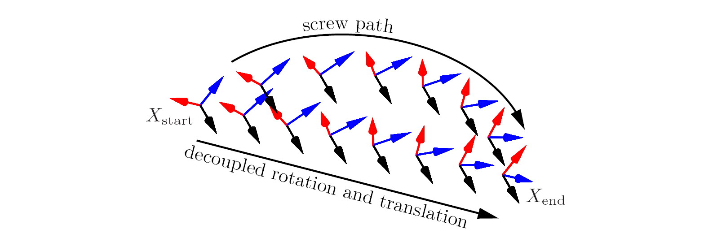
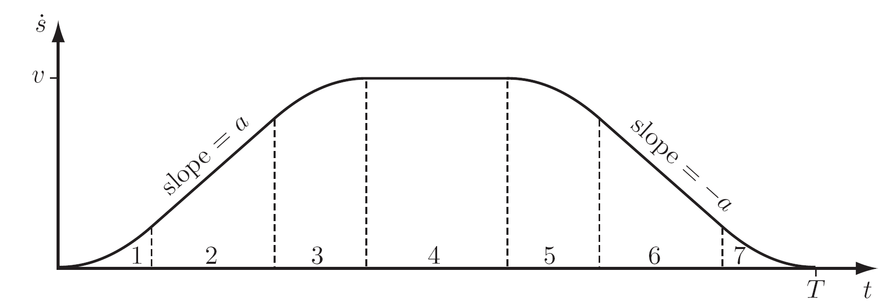

# Modern Robotics Mechanics, Planning, and Control

## __Trajectory Generation__

This specification of the robot position as a function of time is called a __trajectory__

__trajectory planning__, the trajectory should be a sufficiently smooth function of time, and it should respect any given limits on joint velocities, accelerations, or torques

 

### __Trajectory Define__

__path__ $\theta(s)$ maps a scalar path parameter $s$ to a point in the robot's configuration space $\Theta$
$$\theta:[0,1] \rightarrow \Theta$$

__Time scaling__ $s(t)$, $s:[0, T] \rightarrow [0,1]$

__Trajectory__ $\theta(s(t))$ or $\theta(t)$

$$\dot{\theta}=\frac{d\theta}{ds}\dot{s}$$
$$\ddot{\theta}=\frac{d\theta}{ds}\ddot{s}+\frac{d^2\theta}{ds^2}\dot{s}^2$$

 

### __Point-to-Point Trajectories__

#### __Straight-Line Paths__

- define in joint space

  $$\theta_{end}(s)=\theta_{start}+s(\theta_{end}-\theta_{start})$$
  $$s\in [0,1], \quad \theta_i \in [\theta_{i,min}, \theta_{i,max}]$$
  Straight lines in joint space generally do not yield straight-line motion of the end-effector in task space

- define in task space (a minimum set of coordinates)

  $$X_{end}(s)=X_{start}+s(X_{end}-X_{start})$$
  $$s\in [0,1]$$

  - If the path passes near a kinematic singularity, the joint velocities may become unreasonably large for almost all time scalings of the path
  - Since the robot's reachable task space may not be convex in $X$ coordinates, some points on a straight line between two reachable endpoints may not be reachable

- define by screw motion

  $$X(s)=X_{s,start} e^{({\log (X_{s,start}^{-1}X_{s,end})s})}$$

- decouple the screw motion

  $$p(s)=p_{start}+s(p_{end}-p_{start})$$
  $$R(s)=R_{start} e^{({\log (R_{start}^T R_{end})s})}$$

#### __Time Scaling a Straight-Line Path__

A time scaling $s(t)$ of a path should ensure that the motion is appropriately smooth and that any constraints on robot velocity and acceleration are satisfied

- Polynomial Time Scaling
  - Third-order Polynomials
  - Fifth-order Polynomials
- Trapezoidal（$\dot{s}$ 梯形）Motion Profiles
- S-Curve Time Scalings

  avoids vibrations or oscillations induced by step changes in acceleration

  seven stages:
  - constant jerk $d^3s/dt^3 = J$ until a desired acceleration $\ddot{s}=a$ is achieved
  - constant acceleration until the desired $\dot{s}=v$ is being approached
  - constant negative jerk $-J$ until $s$ equals 0 exactly at the time $\dot{s}$ reaches $v$
  - coasting at constant $v$
  - constant negative jerk $-J$
  - constant deceleration $-a$
  - constant positive jerk $J$ until $\ddot{s}$ and $\dot{s}$ reach 0 exactly at the time $s$ reaches 1

  

#### __Point Trajectories__

interpolating a set of via points

- B-spline interpolation

  the path may not pass exactly through the via points, but the path is guaranteed to be confined to the convex hull of the via points, This can be important to ensure that joint limits or workspace obstacles are respected.

### __Time-Optimal Time Scaling__

the fastest possible time scaling $s(t$) that respects the robot's actuator limits

Given a path $\theta(s)$, $s \in [0, 1]$, an initial state $(s_0, \dot{s}_0)=(0, 0)$, and a final state$(s_f ,\dot{s}_f )=(1, 0)$, find a monotonically increasing twice-difierentiable time scaling $s:[0, T]\rightarrow [0, 1]$ that
- satisfies $s(0) = \dot{s}(0) = \dot{s}(T) = 0$ and $s(T) = 1$, and
- minimizes the total travel time $T$ along the path while respecting the actuator constraints

  $$L(s,\dot{s}) \leq \ddot{s} \leq U(s,\dot{s})$$

## __Motion Planning__

Motion planning is the problem of finding a robot motion from a start state to a goal state that avoids obstacles in the environment and satisfies other constraints, such as joint limits or torque limits

The free C-space C free consists of the configurations where the robot neither penetrates an obstacle nor violates a joint limit.

|                    |                                     |
| ------------------ | ----------------------------------- |
| C-space            | $C \subset \Bbb{R^n}$               |
| free C-space       | $C_{free}$                          |
| obstacle space     | $C_{obs}$                           |
| configuration      | $q=(\theta_1, \cdots, \theta_n)$    |
| control inputs     | $u \in U \subset \Bbb{R^m}$         |
| state of the robot | $x=(q, v) \in X$                    |
| states             | $X_{free}=\{x\|q(x) \in C_{free}\}$ |
|                    |                                     |

The equations of motion of the robot
$$\dot{x}=f(x,u)$$
$$x(T)=x(0)+\int_0^T f(x(t), u(t))dt$$

Given an initial state $x(0) = x_{start}$ and a desired final state $x_{goal}$ , find a time $T$ and a set of controls $u : [0,T] \rightarrow U$ such that the motion satisfies $x(T) = x_{goal}$ and $q(x(t)) \in C_{free}$ for all $t \in [0,T]$.

机器人运动规划的基本任务可以描述为：从开始位置到目标位置的运动。这一任务通常涉及到两项基本问题：

- 如何躲避构型空间中出现的障碍物（几何路径规划，全局约束）
- 如何满足机器人本身在机械、传感方面的速度、加速度等限制（不确定性、反馈、微分约束等）

其中，__基于抽样的运动规划__ 算法是用于解决第 1 个问题的重要方法，其核心思想为：先对机器人的单个构型进行碰撞检测，建立无碰撞构型的数据库，再对不同的构型进行采样以生成无碰撞路径。

该算法的优点在于具有通用性，只需要针对不同的机器人运动规划问题进行合理的参数调整。
该算法的缺点在于完备性较弱，即当参数设置不合理时，即使存在可行的路径，也不一定能够找到。

典型的抽样规划方法有 __综合查询方法__ 和 __单一查询方法__ 两类。前者首先构建路线图，先通过采样和碰撞检测建立完整的无向图，以得到构型空间的完整连接属性。再通过图搜索即可得到可行的路径。后者则从特定的初始构型出发局部建立路线图，在构型空间中延伸树型数据结构，最终使它们相连。

### __Configuration Space Obstacles__

Joint limits are treated as obstacles in the configuration space

### __Graph Search__

Once the free space is represented as a graph, a motion plan can be found by searching the graph for a path from the start to the goal.

- __$A^∗$ Search__

  The $A^∗$ search algorithm efficiently finds a __minimum-cost__ path on a graph when the cost of the path is simply the sum of the positive edge costs along the path.

  采用启发式的搜索策略，能够更快地搜索出最短路径

  $A^*$ 算法加入了启发式的搜索策略，在搜索时间上通常优于 Dijkstra 算法。$A^*$ 使用了一个估计值 $F$ 代表某一个节点到终点的估计距离。
  $G(n)$ 起点到节点$n$的真实距离，$H(n)$ 用启发函数计算的节点$n$到终点的距离。启发函数可用 Manhattan distance
  $$F(n)=G(n)+H(n)$$

  

  - 如果不设置启发函数，则 $A^*$ 就是 Dijkstra 算法，这时可以找到最短路径。
  - 如果启发函数 $H(n)$ 的值一定小于等于 $n$ 到终点的实际距离，则 $A^*$ 可以保证找到最短路径。
  - 如果 $H(n)$ 的值等于 $n$ 到终点的实际距离，则 $A^*$ 会直接找到最短路径，而不用扩展搜索额外的节点，此时运行是最快的。
  - 如果 $H(n)$ 的值有可能大于 $n$ 到终点的实际距离，则 $A^*$ 算法不一定可以找到最短路径，但是运行速度会比较快。

- __Dijkstra’s algorithm__

  Dijkstra 算法是一种求解起点到终点最短路径的算法，在用于无权重图时，Dijkstra 算法就是宽度优先 (BFS) 的方法

  假设起点是 $s$，终点是 $e$，Dijkstra 算法的主要包括下面的流程
  - 集合 $F$ 保存已经访问过的节点，初始时 $F$ 只包含起点 $s$。数组 $D$ 保存起点 $s$ 到其余所有节点的最短路径。在开始时，$D$ 的数值用下面的公式计算
    $$D[v]=\begin{cases}
      d(s,v) & \text{如果$s$, $v$直接可达}\\
      \infin & \text{如果$s$, $v$不直接可达}
    \end{cases}$$
  - 找到一个不在 $F$ 中，并且 $D[u]$ 最小的节点 $u$。$D[u]$ 就是起点 $s$ 到节点 $u$ 的最短距离，把 $u$ 加入 $F$
  - 用节点 $u$ 更新数组 $D$ 中的最短距离
    $$D[v]=\begin{cases}
      \min (D[v], D[v]+d(u,v)) & \text{如果$u$, $v$直接可达}\\
      D[v] & \text{如果$s$, $v$不直接可达}
    \end{cases}$$
  - 如果 $F$ 中已经包含终点 $e$，则最短路径已找到，否则继续执行以上步骤
- __Breadth-first search（BFS）__
- __Suboptimal $A^∗$ search__

   If the heuristic cost-to-go is overestimated by multiplying the optimistic heuristic by a constant factor $\lambda > 1$, the $A^∗$ search will be biased to explore from nodes closer to the goal rather than nodes with a low past cost.This may cause a solution to be found more quickly but, unlike the case of an optimistic cost-to-go heuristic, the solution will not be guaranteed to be optimal.

### __Grid Methods__

将搜索空间离散化，通常使用网格

- 邻居节点，四邻接，八邻接
- 四邻接的启发函数可采用曼哈顿距离，即只考虑水平和垂直
- 邻接节点考虑碰撞

Multi-Resolution Grid Representation 多分辨率，将包含障碍的网格细分， This allows the planner to find paths using short steps through cluttered spaces while taking large steps through wide open space
- quadtree 四叉树
- octree 八叉树

Grid Methods with Motion Constraints

### __Sampling Methods__

Sampling methods generally give up on the resolution-optimal solutions of a grid search in exchange for the ability to find satisficing solutions quickly in high-dimensional state spaces

- The __RRT__ Algorithm (rapidly exploring random trees)

  __快速扩展随机树__
  use a tree representation for single-query planning in either C-space or state space

   与PRM算法相同，RRT算法也是 __概率完备__ 的：只要路径存在，且规划的时间足够长，就一定能确保找到一条路径解。注意“且规划的时间足够长”这一前提条件，说明了如果规划器的参数设置不合理（如搜索次数限制太少、采样点过少等），就可能找不到解。

   1. __初始化__。确定规划的起始点。
   2. __随机采样__。在每次选择生长方向时，有一定的概率会向着目标点延伸，也有一定的概率会随机在地图内选择一个方向延伸一段距离。
   3. __生长点选择与碰撞检测__。选择 $RRT$ 树中离采样点最近的点，并向采样点延伸一段距离。假如在这段延伸中没有发生碰撞（碰撞检测），而且新点与现有的所有点的距离大于某个判断阈值（防止生长到 $RRT$ 已经探索过的位置），则将这个新点也加入 $RRT$ 树。
   4. __终止条件__。由于每次延伸的距离是固定的，所以不能保证最后一次延伸能够刚好到达终点的位置，更可能的情况是在终点周围来回跳动。因此设定一个阈值，假如本次延伸的新点与终点的距离小于这个阈值，我们就认为已经规划成功。

    __随机采样概率__：随机采样的概率越大，$RRT$ 树的分支也就越多，反之则难以发生新的分支。概率小，经历了许多次碰撞才能凭借分支绕过障碍物。概率大，由于生长缺乏方向性，分支填充了所有空间直至找到目标点，这样的搜索会消耗大量的时间。

    __生长步长__：当步长太大时，可能无法成功绕过障碍物；当步长过小时，生长的速度显然会有所减慢。一般来说，空间越复杂，步长越小。这里必须注意的是，生长步长一定要比判断是否为同一个采样点的阈值要大
    

    - __Bidirectional RRT__：基本的RRT每次搜索都只有从初始状态点生长的快速扩展随机树来搜索整个状态空间，如果从初始状态点和目标状态点同时生长两棵快速扩展随机树来搜索状态空间，效率会更高
    - $RRT ∗$：
- The __PRM__ Algorithm (probabilistic roadmaps)

   __概率路线图__（Probabilistic Roadmap，$PRM$）属于综合查询方法

   - __预处理__：
      1. __初始化__。设 $G(V,E)$ 为一个无向图，其中顶点集 $V$ 代表无碰撞的构型，连线集 $E$ 代表无碰撞路径。初始状态为空。
      2. __构型采样__。从构型空间中采样一个无碰撞的点 $\alpha(i)$ 并加入到顶点集 $V$ 中。
      3. __邻域计算__。定义距离 $\rho$ ，对于已经存在于顶点集 $V$ 中的点，如果它与 $\alpha(i)$ 的距离小于 $\rho$ ，则将其称作点 $\alpha(i)$ 的邻域点。
      4. __边线连接__。将点 $\alpha(i)$ 与其领域点相连，生成连线 $\tau$ 。
      5. __碰撞检测__。检测连线 $\tau$ 是否与障碍物发生碰撞，如果无碰撞，则将其加入到连线集 $E$ 中。
      6. __结束条件__。当所有采样点（满足采样数量要求）均已完成上述步骤后结束，否则重复2-5。

    - __搜索__：
      采用图搜索算法对无向图 $G$ 进行搜索，如果能找到起始点 $A$ 到终点 $B$ 的路线，说明存在可行的运动规划方案。

  __采样数量的影响__：对同一地图，采样点的数量越多，找到合理路径以及更优路径的概率就越大。但同时，采样点数量越多，计算与搜索时间也会更长。

  __邻域设置的影响__：影响着连线的建立与检测。当邻域设置过小，由于连线路径太少，可能找不到解；当领域设置太大，会检测太多较远的点之间的连线，而增加耗时。

  但需要注意，抽样方法的完备性很弱，即使空间中存在合理的路径，由于抽样参数的设置问题，也可能无法找到路径；另外，由于抽样过程的随机性，该方法的稳定性也不好，对于同样的问题，前后两次的解也不一样，因此在严格要求稳定性的场合并不适用。

  

### __Virtual Potential Fields 虚拟势能场__

原理：势能场 $P(q)$ 产生力 $F=-\frac{\partial P}{\partial q}$，推动物体从高势能到低势能

在机器人运动控制中，目标构型 $q_{goal}$ 被赋予低的虚拟势能，而障碍物被赋予高的虚拟势能。沿着虚拟势能场梯度反方向对机器人施加力，可使机器人迎向目标而原理障碍。

势能场的梯度计算快，意味着可实时运动规划。通过某些传感器，此方法甚至可以处理移动或突然出现的障碍。缺点是即使目标路径存在，机器人也可能会停止在势场局部极小值而不是目标。在某些情况下可以设计势能场保证目标是唯一的局部极小点。

#### __点构型空间势能__

__目标势能__，是最低势能，以及产生引力，$K$ 是对称正定权值矩阵
$$P_{goal}(q)=\frac{1}{2}(q-q_{goal})^TK(q-q_{goal})$$
$$F_{goal}(q)=K(q_{goal}-q)$$

__障碍势能__，$k>0$ 缩放因子，注意只定义距离大于0处的势场，障碍内部不定义
$$P_B(q)=\frac{k}{2d^2(q,B)}$$
$$F_B(q)=\frac{k}{d^3(q,B)}\frac{\partial d}{\partial q}$$
改进
$$U_B(q)=\begin{cases}
  \frac{k}{2} \left( \frac{d_{range}-d(q,B)}{d_{range}d(q,B)} \right)^2 & \text{if $d(q,B) <d_{range}$}\\
  0 & \text{otherwise}
\end{cases}$$

总的势能就是目标势能和所有障碍势能之和，力也是如此。通常在目标未必是最小值处，同时也注意势能和力的界限。

两种方式使用场力来控制机器人运动

- 添加额外阻尼。$u=F(q)-B\dot{q}$
  - 如果 $B$ 是正定的，$\dot{q} \not ={0}$ 会消耗能量，减少振荡保证机器人最终停止。
  - 如果 $B=0$，机器人将持续运动，总能量为初始运动能和初始虚拟势能之和（$\frac{1}{2}\dot{q}^T(0)M(q(0))\dot{q}(0)+P(q(0))$）
- 将力作为被控速度。$\dot{q}=F(q)$，将自动消除振荡。

#### __导航函数__

为了解决局部极小值问题

$\varphi(q)$
- 对 $q$ 光滑，或至少二阶可微
- 在所有障碍边界处具有最大值
- $q_{goal}$ 是唯一最小值
- 在所有临界点（$\frac{\partial \varphi}{\partial q}=0$），$q$ 有满秩 Hessian 矩阵 $\frac{\partial^2 \varphi}{\partial q^2}$。 如 Morse函数

势能场可以用于路径规划，如配合 $A^*$ 算法用于作为路径代价估计，可防止规划一直陷入局部极小值

### __Nonlinear Optimization__

路径规划问题可以看成是具有等式和不等式约束的通用非线性优化问题。

### __Smoothing__

网格规划和随机采样规划可能会导致机器人运动抖动，可以通过将以上方法获得的路径进行平滑处理。

## __机器人控制__

> - 什么是力控
> - 终端执行器没有力反馈的力控
> - 具有力反馈的力控 PI
> - 不使用微分控制的原因
> - 混合控制：某些方向的运动控制，其他方向的力控
> - 约束
> - 混合控制中独立设计运动控制器和力控制器
> - 阻抗控制
>   - 机器人环境模拟
>   - 阻抗 导纳

机器人控制器的工作是将任务转换为执行机构的力和扭矩。根据控制策略的不同，分为以下几种

- 运动控制 motion control
- 力控 force control
- 混合控制 hybrid motion–force control
- 阻抗控制 impedance control

力学施加的基本约束，与环境无关：机器人不能独立地控制同一方向的运动和力。如果机器人施加一个运动，那么环境将决定力；如果机器人施加一个力，那么环境将决定运动。

反馈控制使用位置、速度和力传感器来测量机器人的实际行为。反馈控制器的目的是为了将误差消除或者减小为一个很小值。

误差的单位误差响应：$\theta_e(t), t > 0$，初始条件 $\theta_e(0)=1$，其他各阶导数为$0$。

### __力控__

当任务不是关于终端执行器的运动，而是应用力和扭矩到环境中，需要力控。

- 理想的力控：终端执行器施加的力不受运动扰动影响。
- 理想的运动控制：终端执行器的运动不受力的扰动影响。

__力控__：
$$M(\theta)\ddot{\theta}+c(\theta,\dot{\theta})+g(\theta)+b(\dot{\theta})+J^T(\theta)\mathcal{F}_{tip}=\tau$$
- $\mathcal{F}_{tip}$ 执行机构施加给环境的力旋量。
- $\mathcal{F}_{tip}$ 和 $J(\theta)$ 定义在相同的坐标系下（空间坐标系或终端执行器坐标系。）

__简化力控__：通常在力控任务中，运动都很慢，故可以忽略加速度和速度项
$$g(\theta)+J^T(\theta)\mathcal{F}_{tip}=\tau$$

__关节反馈力控__：如果不能直接测量终端执行器力或扭矩，可以只用关节反馈来控制
$$\tau=\overset{\sim}{g}(\theta)+J^T(\theta)\mathcal{F}_d$$
- $\overset{\sim}{g}(\theta)$ 重力扭矩建模。
- $\mathcal{F}_d$ 期望的力旋量。

__具有力反馈的力控__：如果可以直接测量手臂和终端执行器之间的力或扭矩 $\mathcal{F}_{tip}$，使用 $PI$ 控制器
$$\tau=\overset{\sim}{g}(\theta)+J^T(\theta)(\mathcal{F}_d+K_{fp}\mathcal{F}_e+K_{fi}\int \mathcal{F}_e(t)dt)$$

- $\mathcal{F}_e=\mathcal{F}_d-\mathcal{F}_{tip}$
- $K_{fp}$ 和 $K_{fi}$ 是正定的比例积分项矩阵。
- 不使用微分控制
  - 力测量通常会受到噪声影响，这种情况下计算微分没有意义。
  - 我们假设直接控制关节扭矩和力，简单的刚体动力学模型意味着直接传递到末端执行器的力——不存在整合控制命令来产生期望行为的动力学，这与运动控制不同。
- 如果重力建模的很准确，易得误差动力学方程
  $$K_{fp}\mathcal{F}_e+K_{fi}\int \mathcal{F}_e(t)dt=0$$
- 如果重力建模的不准确，则上式需考虑力扰动，对它微分，此时 $\mathcal{F}_e$ 将收敛到 $0$
  $$K_{fp}\dot{\mathcal{F}}_e+K_{fi}\mathcal{F}_e=0$$

__修正加速度__：假如终端执行器处于空载状态，会错误得尝试产生加速度来产生力。考虑到典型的力控任务会有小的运动，通过加入速度阻尼来限制加速度。
$$\tau=\overset{\sim}{g}(\theta)+J^T(\theta)(\mathcal{F}_d+K_{fp}\mathcal{F}_e+K_{fi}\int \mathcal{F}_e(t)dt-K_{damp}\mathcal{V})$$
- $K_{damp}$ 是正定的。

### __混合运动-力控制__

$n$ 维任务空间中，运动和力的所有自由度是 $2n$
- 任意时刻，可以控制 $n$ 个自由度（控制的运动和力自由度之和）；其他 $n$ 个自由度将由环境决定。
- 运动控制和力控不可施加于同一方向，它们不是独立的。

假如环境在 $k$ 个方向提供了刚体约束，在 $n-k$ 个方向未提供约束，则环境决定了可以在 $k$ 个方向自由的施加力，在 $n-k$ 个方向上自由的运动。

__自然约束__： natural constraints，由环境决定（跟任务相关），是完整约束。约束速度旋量的 $k$ 个分量和力旋量的 $n-k$ 个分量。

__人工约束__： artificial constraints，由任务决定。可自由约束力旋量的 $k$ 个分量和速度旋量的 $n-k$ 个分量。

> 考虑机械臂擦黑板例子
> $\mathcal{V}_b=(\omega_x, \omega_y, \omega_z, v_x, v_y, v_z)$，
> $\mathcal{F}_b=(m_x, m_y, m_z, f_x, f_y, f_z)$
>
> 环境限制了 $\omega_x=0$， $\omega_y=0$， $v_z=0$，$m_z=0$，$f_x=0$， $f_y=0$
>
> 机械臂可以自由控制 $\omega_z$， $v_x$， $v_y$，$m_x$， $m_y$， $f_z$
>
> |自然约束|人工约束|
> |------|-----|
> |$\omega_x=0$|$m_x=0$|
> |$\omega_y=0$|$m_y=0$|
> |$v_z=0$|$f_z=k_1 < 0$|
> |$m_z=0$|$\omega_z=0$|
> |$f_x=0$|$v_x=k_2$|
> |$f_y=0$|$v_y=k_3$|

__任务空间动力学__：执行器产生的关节扭矩和力 $\tau=J^T(\theta)\mathcal{F}$。
- 无约束
  $$\mathcal{F}=\Lambda(\theta)\dot{\mathcal{V}}+\eta(\theta,\mathcal{V})$$
- 有约束
  $$\mathcal{F}=\Lambda(\theta)\dot{\mathcal{V}}+\eta(\theta,\mathcal{V})+A^T(\theta)\lambda$$

  - 任务空间 $k$ 个在速度上的自然约束满足
    $$A(\theta)\mathcal{V}=0$$
    $$A(\theta)\dot{\mathcal{V}}+\dot{A}(\theta)\mathcal{V}=0$$
  - $A(\theta) \in \mathbb{R}^{k \times 6}, \mathcal{V} \in \mathbb{R}^6$
  - 机器人抗拒约束产生的力旋量 $\mathcal{F}_{tip}=A^T(\theta)\lambda$， $\lambda \in \mathbb{R}^k$。
  - 期望力旋量 $\mathcal{F}_d$ 必须处于 $A^T(\theta)$ 列空间。

__混合控制器__：假设存在 $k$ 个在速度上的自然约束。
- 求解动力学 $\mathcal{F}_{tip}$

  当系统已经满足了速度约束，为了确保同样满足速度约束的微分式，期望加速度必须满足 $A(\theta)\dot{\mathcal{V}_d}=0$。
  $$\lambda=(A\Lambda^{-1}A^T)^{-1}(A\Lambda^{-1}(\mathcal{F}-\eta)-A\dot{\mathcal{V}})$$
  $$\mathcal{F}_{tip}=A^T(\theta)\lambda$$
- 动力学分解

  $$P(\theta)=I-A^T (A\Lambda^{-1}A^T)^{-1} A\Lambda^{-1}$$
  - $P \in \mathbb{R}^{n \times n}$。$P$ 将 $n$ 维力旋量空间分解成 __解决运动控制任务__ 和 __解决力控任务__ 两部分。
  - $rank(P)=n-k$。$P$ 将任意力旋量 $\mathcal{F}$ 投影到满足力约束的力旋量子空间，得到 $n-k$ 个独立的运动方程。
  - $rank(I-P)=k$。$I-P$ 将任意力旋量 $\mathcal{F}$ 投影到抵抗力约束的力旋量子空间，得到 $k$ 个独立的力控方程。
- 混合控制器
  $$\tau=J_b^T(\theta)(\mathcal{F}_{motion}+\mathcal{F}_{force}+\overset{\sim}\eta(\theta,\mathcal{V}_b))$$
  - $\mathcal{F}_{motion}=P(\theta)\left(\overset{\sim}\Lambda(\theta)\left(\frac{d}{dt}([Ad_{X^{-1}X_d}]\mathcal{V}_b)+K_pX_e+K_i\int X_e(t)dt+K_d\mathcal{V}_e\right)\right)$
  - $\mathcal{F}_{force}=(I-P(\theta))\left(\mathcal{F}_d+K_{fp}\mathcal{F}_e+K_{fi}\int \mathcal{F}_e(t)dt\right)$
  - $\overset{\sim}\eta(\theta,\mathcal{V}_b)$ 科里奥利力和重力。
  - 由于 $P$ 和 $I-P$ 正交，则此控制器可以分别在运动控制和力控子空间独立分析各自的误差动力学和稳定性。

__混合控制器难点__：
- 在刚性环境中了解任意时刻活动约束的形式。
  - 一种方法是利用实时估计算法在力反馈的基础上识别约束方向。
  - 一种方法是通过选择低反馈增益来牺牲一些性能，这使得运动控制器变“软”，力控制器对力误差的容忍度更高。也可以在机器人本身的结构中构建被动顺从来达到类似的效果。在任何情况下，由于关节和连接的灵活性，一些被动顺从是不可避免的。

### __阻抗控制__

理想的刚性环境下的运动-力混合控制要求机器人具有极端阻抗。理想运动控制对应于高阻抗(由于力的干扰运动变化很小)，而理想力控制对应于低阻抗(由于运动的扰动力变化很小)。在实践中，机器人的阻抗范围是有限制的。

阻抗控制器测量末端执行器的运动并产生端点力来模拟质量-弹簧-阻尼系统。导纳控制器测量末端执行器的力并创建端点运动以达到相同的目的。

$$m\ddot{x} + b \dot{x} + kx = f$$

对机器人的动力学方程进行拉普拉斯变换，可以得到阻抗和导纳。$F(s)$ 是力的变换，$X(s)$ 是运动的变换。
- 阻抗 impedance
  $$Z(s)=\frac{F(s)}{X(s)}$$
  - 与频率相关，弹簧特性决定了低频响应，质量决定了高频响应。
  - 好的运动控制呈现高阻抗低导纳（由于力的干扰运动变化很小）。
  $$\Delta X=Y \Delta F$$
- 导纳 admittance
  $$Y(s)=\frac{X(s)}{F(s)}$$
  - 好的力控制呈现低阻抗高导纳（由于运动的扰动力变化很小）。
  $$\Delta F=Z \Delta X$$

任务空间阻抗控制
$$M\ddot{x} + B \dot{x} + Kx = f_{ext}$$
- $M$，$B$，$K$ 是正定虚拟质量、阻尼、弹性特性。
- $f_{ext}$ 是外部施加给机器人的力。

__阻抗控制__：从理论上讲，阻抗控制机器人只能耦合到导纳型环境中。在阻抗控制算法中，编码器、转速计，加速度计用来估计关节和端点位置、速度，加速度。阻抗控制机器人通常不配备腕力-力矩传感器，而是依靠其精确控制关节力矩的能力来呈现适当的末端执行器力。通过增加末端执行器力-扭矩传感器，使用反馈项，可以实现更接近所需的相互作用力。
$$\tau=J^T(\theta)(\overset{\sim}\Lambda(\theta)\ddot{x}+\overset{\sim}\eta(\theta,\dot{x})-(M\ddot{x} + B \dot{x} + Kx))$$

模拟僵硬环境的问题 （$K$ 很大）
- 通过编码器测量的位置的微小变化，会导致电机扭矩的巨大变化。这种有效的高增益，加上延迟、传感器量子化和传感器误差，会导致振荡行为或不稳定。
- 在模拟低阻抗环境时，有效增益很低。

__导纳控制__：从理论上讲，导纳控制机器人只能耦合到阻抗型环境中。在导纳控制算法中，外部施加的力 $f_{ext}$ 由腕部测力单元感知，机器人以末端执行器加速度响应。
$$\ddot{x}_d=M^{-1}(f_{ext}-B \dot{x}-Kx)$$
$$\dot{x}=J(\theta)\dot{\theta}$$
$$\ddot{\theta}_d=J^{+}(\theta)(\ddot{x}_d-\dot{J}(\theta)\dot{\theta})$$
利用逆动力学可以求得需要控制的力和扭矩。

- 当目标仅是模拟弹簧或阻尼器时，可以得到该控制律的简化版本。为了使响应在面对有噪声的力测量时更平滑，力读数可以低通过滤。
- 对于导纳控制机器人来说，模拟低质量环境具有挑战性，因为小的力会产生大的加速度。
- 有效的大增益会产生不稳定性。然而，高齿轮传动机器人的导纳控制可以很好地模拟僵硬的环境。