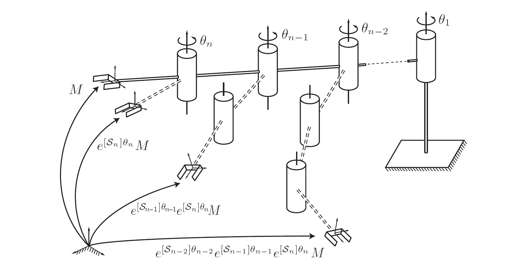
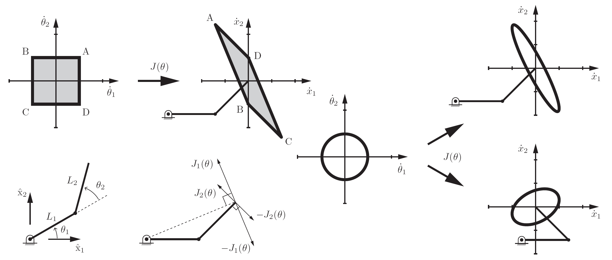
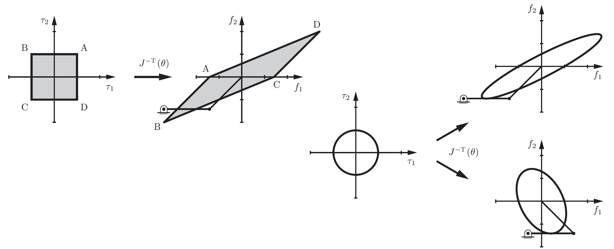
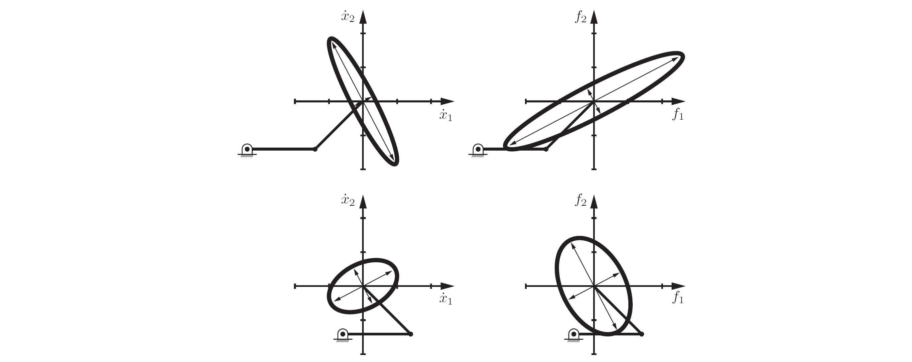
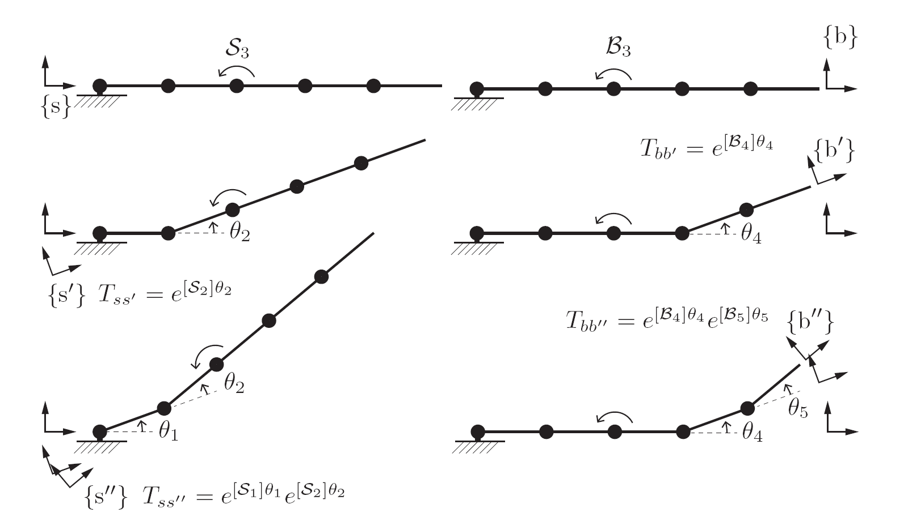
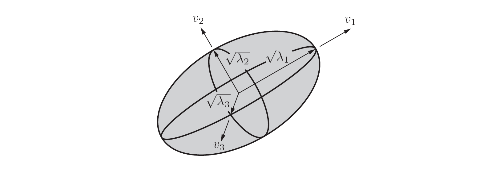
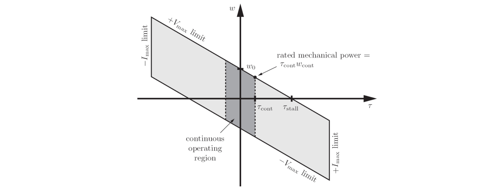

# Modern Robotics Mechanics, Planning, and Control

## 基本数学

Moore-Penrose **pseudoinverse** $J^{\nmid}$

For any equation of the form $Jy = z$, where $J \in \Bbb{R^{m \times n}}$, $y \in \Bbb{R^n}$, and $z \in \Bbb{R^m}$, the solution
$$y^*=J^{\nmid} z$$ 
falls into one of two categories:

1. The solution $y^*$ exactly satisfies $Jy^* = z$ and, for any solution $y$ exactly satisfying $Jy = z$, we have $\|y^*\| \le \|y\|$, among all solutions, $y^*$ minimizes the two-norm. There can be an infinite number of solutions $y$ to $Jy = z$ if the robot has more joints $n$ than end-effector coordinates $m$, i.e., the Jacobian $J$ is "fat."
2. If there is no $y$ that exactly satisfies $Jy = z$ then $y^*$ minimizes the two-norm of the error, i.e., $\|Jy^*-z\| \le\|Jy-z\|$ for any $y \in \Bbb{R^n}$. This case corresponds to $rank J < m$, i.e., the robot has fewer joints $n$ than end-effector coordinates $m$ (a "tall" Jacobian $J$) or it is at a singularity.

In the case where $J$ is full rank the robot is not at a singularity, the pseudoinverse can be calculated as
$$J^{\nmid}=\begin{cases}
  J^T(JJ^T)^{-1} & \text{ if $J$ is fat, $n > m$ (called a right inverse since $JJ^{\nmid} = I$)}\\ (J^TJ)^{-1}J^T & \text{ if $J$ is tall, $n < m$ (called a left inverse since $J^{\nmid}J = I$)}\end{cases}$$

 

## 
Forward Kinematics

 

Representation for the forward kinematics of open chains
- Denavit-Hartenberg parameters (**D-H** parameters)
- product of exponentials (**PoE**)

 

### __Product of Exponentials Formula__

1. a stationary frame $\{s\}$ at the fixed base of the robot or anywhere else that is convenient for defining a reference frame.
2. a frame $\{b\}$ at the end-endector, described by $M$ when the robot is at its zero position.

> the PoE formula for an n-link spatial open chain
> 

 

_focus_ : $M$ and $T(\theta)$ are expressed in $\{s\}$

#### __First Formulation: Screw Axes in the Base Frame {s}__ 

 

The key concept behind the PoE formula is to regard each joint as applying a screw motion to all the outward links.

- **space form** of the product of exponentials formula

  $$T(\theta)=e^{[S_1]\theta_1} \cdots e^{[S_{n-1}]\theta_{n-1}} e^{[S_n]\theta_n} M$$

  This is the product of exponentials formula describing the forward kinematics of an $n$-$dof$ open chain.

  1. the end-effctor configuration $M \in SE(3)$ when the robot is at its home position
  2. the screw axes $S_1,\cdots,S_n$ expressed in the fixed base frame, corresponding to the joint motions when the robot is at its home position
  3. the joint variables $\theta_1,\cdots,\theta_n$

 

#### __Second Formulation: Screw Axes in the End-Effector Frame {b}__

 

- **body form** of the product of exponentials formula

  $$T(\theta)=Me^{[B_1]\theta_1} \cdots e^{[B_{n-1}]\theta_{n-1}} e^{[B_n]\theta_n}$$

  representing the joint axes as screw axes $B_i$ in the end-effector (body) frame when the robot is at its zero position
 

#### __Screw axes in {s} and {b}__

 

$$[B_i]=M^{-1}[S_i]M$$
$$B_i=[Ad_{T^{-1}}]S_i$$

It makes sense that we need to determine the screw axes only at the robot's zero position: 
- any $S_i$ is unaffected by more distal(远) transformations
- any $B_i$ is unaffected by more proximal(近) transformations

 
 

## 
Velocity Kinematics and Statics

 

the end-effector configuration is represented by a minimal set of coordinates $x \in \Bbb{R^m}$, and the velocity is given by $\dot{x}=dx/dt \in \Bbb{R^m}$, $\theta \in \Bbb{R^n}$ is a set of joint variables, so the forward kinematics
$$x(t)=f(\theta(t))$$

and $J(\theta) \in \Bbb{R^{m \times n}}$ is **Jacobian**, also known as **analytic Jacobian**
$$\dot{x}=\frac{\partial{f(\theta)}}{\partial{\theta}}\dot{\theta}=J(\theta)\dot{\theta}$$

The Jacobian matrix represents the linear sensitivity of the end-effector velocity $\dot{x}$ to the joint velocity $\dot{\theta}$, and it is a function of the joint variables $\theta$.

 

__Jacobian__

Consider a 2R planar open chain, the tip velocity $\dot{x}$ as $v_{tip}$

If $J(\theta)$ isn't invertiable, such configurations are therefore called **singularities**; they are characterized by a situation where the robot tip is unable to generate velocities in certain directions.

- **manipulability ellipsoid**

  Map a unit circle of joint velocities through the Jacobian in the $\dot{\theta}_1$-$\dot{\theta}_2$ plane. This circle represents an "iso-effort"(等值) contour in the joint velocity space, where total actuator effort is considered to be the sum of squares of the joint velocities.

  

  As the manipulator configuration approaches a singularity, the ellipse collapses to a line segment, since the ability of the tip to move in one direction is lost.

  Using the manipulability ellipsoid one can quantify how close a given posture is to a singularity.
  > we can compare the lengths of the major and minor principal semi-axes of the manipulability ellipsoid, respectively denoted $l_{max}$ and $l_{min}$. The closer the ellipsoid is to a circle,  the closer the ratio $l_{max}/l_{min}$ is to $1$, the more easily can the tip move in arbitrary directions and thus the more removed it is from a singularity.

- **force ellipsoid**

  Static analysis : Suppose that an external force is applied to the robot tip. What are the joint torques required to resist this external force?

  Denoting the tip force vector generated by the robot as $f_{tip}$ and the joint torque vector by $\tau$, the conservation of power then requires that
  $$f_{tip}^Tv_{tip}=\tau^T \dot{\theta} \Rightarrow \tau=J^T(\theta)f_{tip}$$

  

  > The force ellipsoid illustrates how easily the robot can generate forces in different directions.

If it is easy to generate a tip velocity in a given direction then it is dificult to generate a force in that same direction, and vice versa.

> At a singularity, the force ellipsoid becomes infinitely long in a direction orthogonal to the manipulability ellipsoid line segment and skinny in the orthogonal direction.
> 

 

### __Manipulator Jacobian__

Given the configuration $\theta$ of the robot, the 6-vector $J_i(\theta)$, which is column $i$ of $J(\theta)$, is the twist $V$ when $\dot{\theta_i}=1$ and all other joint velocities are zero.

Geometric Jacobian : Space Jacobian, Body Jacobian

 

#### __Space Jacobian__

Let the forward kinematics of an $n$-link open chain be expressed in the following product of exponentials form:
$$T=e^{[S_1]\theta_1} \cdots e^{[S_{n-1}]\theta_{n-1}} e^{[S_n]\theta_n} M$$

The **space Jacobian** $J_s(\theta) \in \Bbb{R^{6 \times n}}$ relates the joint rate vector $\dot{\theta} \in \Bbb{R^n}$ to the spatial twist $V_s=(\omega_s, v_s)$ via
$$V_s=J_s(\theta)\dot{\theta}$$

The $i$th column of $J_s(\theta)$ is
$$\begin{aligned}
  J_{si}(\theta) & = Ad_{e^{[S_1]\theta_1} \cdots e^{[S_{i-1}]\theta_{i-1}}}(S_i) \\
  & = Ad_{T_{i-1}}(S_i)
\end{aligned}$$

for $i=2,...,n$, with the first column $J_{s1}=S_1$.

each column $J_{si}(\theta)$ is the screw vector describing joint axis $i$, expressed in fixed-frame coordinates, but for arbitrary $\theta$ rather than $\theta=0$.

 

#### __Body Jacobian__

Let the forward kinematics of an $n$-link open chain be expressed in the following product of exponentials form:

$$T=Me^{[B_1]\theta_1} \cdots e^{[B_{n-1}]\theta_{n-1}} e^{[B_n]\theta_n}$$

The **Body Jacobian** $J_b(\theta) \in \Bbb{R^{6 \times n}}$ relates the joint rate vector $\dot{\theta} \in \Bbb{R^n}$ to the end-effector twist $V_b=(\omega_b, v_b)$ via
$$V_b=J_b(\theta)\dot{\theta}$$

The $i$th column of $J_b(\theta)$ is
$$\begin{aligned}
  J_{bi}(\theta) & = Ad_{e^{-[B_n]\theta_n} \cdots e^{-[B_{i+1}]\theta_{i+1}}}(B_i)
\end{aligned}$$

for $i=n-1,...,1$, with the first column $J_{bn}=B_n$.

each column $J_{bi}(\theta)$ is the screw vector describing joint axis $i$, expressed in the end-effector frame coordinates, but for arbitrary $\theta$ rather than $\theta=0$.

 

__Visualizing the Space and Body Jacobian__

> 
> 
> The column $J_{s3}$ is the screw axis of joint $3$ relative to $\{s\}$, $S_3$ represents the screw relative to $\{s''\}$for arbitrary joint angles $\theta_1$ and $\theta_2$
> 
> The column $J_{b3}$ is the screw axis of joint $3$ expressed in $\{b''\}$, $B_3$ represents the screw relative to $\{b\}$ for arbitrary joint angles $\theta_4$ and $\theta_5$

 

__Relationship between the Space and Body Jacobian__

$$J_s(\theta)=[Ad_{T_{sb}}]J_b(\theta)$$
$$J_b(\theta)=[Ad_{T_{bs}}]J_s(\theta)$$

 

### __Statics of Open Chains__

Considering the robot to be at static equilibrium, the power at the joints to the power at the end-effector, where $\tau$ is the column vector of the joint torques
$$\tau^T \dot{\theta}=F_b^{T}V_b$$

So
$$\tau=J^T_b(\theta)F_b$$
$$\tau=J^T_s(\theta)F_s$$

If an external wrench $F$ is applied to the end-effector when the robot is at equilibrium with joint values $\theta$, above calculates the joint torques $\tau$ needed to generate the opposing wrench $F$, keeping the robot at equilibrium.

- If $J^T$ is a $6 \times 6$ invertible matrix, then clearly $F=J^{-T}(\theta)\tau$.
- If the robot is redundant ($n > 6$) then even if the end-effector is embedded in concrete, the robot is not immobilized and the joint torques may cause internal motions of the links. The static equilibrium assumption is no longer satisfied, and we need to include dynamics to know what will happen to the robot.
- If $n \leq 6$ and $J_T$ has rank $n$, then embedding the end-effector in concrete will immobilize the robot.
- If $n < 6$, no matter what $\tau$ we choose, the robot cannot actively generate forces in the $6-n$ wrench directions defined by the **null space** of $J_T$, $Null(J^T(\theta))=\{F|J^T(\theta)F=0\}$, since no actuators act in these directions.The robot can resist arbitrary externally applied wrenches in the space $Null(J^T(\theta))$ without moving, owing to the lack of joints that would allow motions due to these forces.

 

### __Singularity Analysis__

The Jacobian allows us to identify postures at which the robot's end-effector loses the ability to move instantaneously in one or more directions, Such a posture is called a **kinematic singularity**, or simply a singularity.

A singular posture is one in which the Jacobian $J(\theta)$ fails to be of maximal rank.

- kinematic singularity is independent of the choice of body or space Jacobian
- Kinematic singularities are also independent of the choice of fixed frame and end-effector frame
  
 

### __Manipulability__

If a nonsingular configuration is "close" to being singular?

The manipulability ellipsoid allows one to visualize geometrically the directions in which the end-effector moves with least effort or with greatest effort.

For a general $n$-joint open chain and a task space with coordinates $q \in \Bbb{R^m}$, where $m \leq n$, the manipulability ellipsoid corresponds to the end-effector velocities for joint rates $\dot{\theta}$ satisfying $\|\dot{\theta}\|=1$, a unit sphere in the $n$-dimensional joint-velocity space.

Assuming $J$ is invertible, the unit joint-velocity condition can be written
$$\begin{aligned}
  1 & =\dot{\theta}^T \dot{\theta}\\
  &=(J^{-1}\dot{q})^T(J^{-1}\dot{q})\\
  &=\dot{q}^T (JJ^T)^{-1} \dot{q}\\
  &=\dot{q}^T A^{-1} \dot{q}
\end{aligned}
$$

If $J$ is full rank, the matrix $A=JJ^T \in \Bbb{R^{m \times m}}$ is square, symmetric, and positive definite, as is $A^{-1}$.

> For any symmetric positive-definite $A^{-1} \in \Bbb{R^{m \times m}}$, the set of vectors $\dot{q} \in \Bbb{R^m}$ satisfying $\dot{q}^T A^{-1} \dot{q}=1$ defnes an ellipsoid in the m-dimensional space.

Letting $v_i$ and $\lambda_i$ be the eigenvectors and eigenvalues of $A$, the directions of the principal axes of the ellipsoid are $v_i$ and the lengths of the principal semi-axes are $\sqrt{\lambda_i}$, the volume $V$ of the ellipsoid is proportional to the product of the semi-axis lengths: $\sqrt{\sum_{i=1}^m \lambda_i}=\sqrt{\det{A}}=\sqrt{\det{JJ^T}}$

> It makes sense to separate the $J$ to $J_{\omega}$ and $J_v$ because the units of angular velocity and linear velocity are diffierent.
>
> When calculating the linear-velocity manipulability ellipsoid, it generally makes more sense to use the body Jacobian $J_b$.

Assign a single scalar measure defining how easily the robot can move at a given posture

- the ratio of the longest and shortest semi-axes of the manipulability ellipsoid
  
  $$\mu_1(A)=\frac{\sqrt{\lambda_{max}(A)}}{\sqrt{\lambda_{min}(A)}} \geq 1$$
  - $\mu_1(A)$ is low, then the manipulability ellipsoid is nearly spherical or isotropic(各向同性), meaning that it is equally easy to move in any direction. 
  - $\mu_1(A)$ goes to infinity, as the robot approaches a singularity.

- condition number of the matrix $A$

  $$\mu_2(A)=\frac{\lambda_{max}(A)}{\lambda_{min}(A)} \geq 1$$

  The condition number of a matrix is commonly used to characterize the sensitivity of the result of multiplying that matrix by a vector to small errors in the vector

- proportional to the volume of the manipulability ellipsoid

  $$\mu_3(A)=\sqrt{\sum_{i=1}^m \lambda_i}=\sqrt{\det{A}}$$

  A larger value is better

 

a force ellipsoid can be drawn for joint torques $\tau$ satisfying $\|\tau\|=1$
$$\begin{aligned}
  1 & =f^T (JJ^T) f\\
  &=f^T B^{-1} f
\end{aligned}, B=(JJ^T)^{-1}=A^{-1}
$$

- the principal axes of the force ellipsoid are aligned with the principal axes of the manipulability ellipsoid
- the lengths of the principal semi-axes of the force ellipsoid are given by $1/\sqrt{\lambda_i}$

 
 

##  
Inverse Kinematics

 

A spatial six-dof open chain's inverse kinematics:

Given some end-effector frame $X \in SE(3)$ the inverse kinematics problem is to find solutions $\theta \in \Bbb{R^6}$ satisfying $T(\theta) = X$, where $T(\theta)=\prod_{i=1}^6 e^{[S_i]\theta_i}M$.

 

### __Analytic Inverse Kinematics__

Use geometric inverse kinematic algorithms.

 

### __Numerical Inverse Kinematics__

- #### Newton-Raphson Method

  Solve the equation $g(\theta)=0$, where diffierentiable function $g: \Bbb{R} \rightarrow \Bbb{R}$, assume $\theta^0$ is an initial guess for the solution, use the Taylor expansion of $g(\theta)$ at $\theta^0$ and truncate it at first order:
  $$g(\theta)=g(\theta^0)+\frac{\partial{g(\theta^0)}}{\partial{\theta}}(\theta-\theta^0) + \cdots$$

  because $g(\theta)=0$, then
  $$\theta=\theta^0-(\frac{\partial{g(\theta^0)}}{\partial{\theta}})^{-1}g(\theta^0)$$

  repeat the procedure until some stopping criterion is satisified
  $$\theta^{k+1}=\theta^k-(\frac{\partial{g(\theta^k)}}{\partial{\theta}})^{-1}g(\theta^k)$$
  $$\frac{|g(\theta^{k+1})-g(\theta^{k})|}{|g(\theta^{k})|} \leq \epsilon$$

  for multi-dimensional $g: \Bbb{R^n} \rightarrow \Bbb{R^n}$, 
  $$\frac{\partial{g(\theta)}}{\partial{\theta}}=\begin{bmatrix}
    \frac{\partial{g_1(\theta)}}{\partial{\theta_1}} & \cdots & \frac{\partial{g_1(\theta)}}{\partial{\theta_n}}\\
    \vdots & \ddots & \vdots\\
    \frac{\partial{g_n(\theta)}}{\partial{\theta_1}} & \cdots & \frac{\partial{g_n(\theta)}}{\partial{\theta_n}}
  \end{bmatrix} = J(\theta)=\in \Bbb{R^{n \times n}}$$

- #### Numerical Inverse Kinematics Algorithm

  - Newton-Raphson iterative algorithm for finding coordinate vector $x_d$: $x=f(\theta)$, $f:\Bbb{R^n} \rightarrow \Bbb{R^m}$

    1. Initialization: Given $x_d \in \Bbb{R^m}$ and an initial guess $\theta^0 \in \Bbb{R^n}$, set $i = 0$.
    2. Set $e = x_d - f(\theta^i)$. While $\|e\| > \epsilon$ for some small $\epsilon$:
      1. Set $\theta^{i+1} = \theta^i + J^{\nmid}(\theta^i)e$.
      2. Increment $i$.

    > think of $e = x_d - f(\theta^i)$ as a velocity vector which, if followed for unit time, would cause a motion from $f(\theta^i)$ to $x_d$.

  - Newton-Raphson iterative algorithm for finding $T_{sd} \in SE(3)$

    1. Initialization: Given $T_{sd}$ and an initial guess $\theta^0 \in \Bbb{R^n}$, set $i = 0$.
    2. Set $[V_b]=\log(T_{bd}(\theta^i))=\log(T_{sb}^{-1}(\theta^i) T_{sd})$. While $\|\omega_b\| > \epsilon_{\omega}$ or $\|v_b\| > \epsilon_{v}$ for small $\epsilon_{\omega}$, $\epsilon_{v}$:
      1. Set $\theta^{i+1} = \theta^i + J_b^{\nmid}(\theta^i)V_b$.
      2. Increment $i$.

    > look for a body twist $V_b$ which, if followed for unit time, would cause a motion from $T_{sb}(\theta^i)$ to the desired configuration $T_{sd}$.

  For this numerical inverse kinematics method to converge, the initial guess $\theta^0$ should be sufficiently close to a solution $\theta_d$

 

### __Inverse Velocity Kinematics__

Solutions for controlling a robot so that it follows a desired end-effector trajectory $T_{sd}(t)$ are

- calculate the inverse kinematics $\theta_d(k \Delta t)$ at each discrete timestep $k$, then control the joint velocities $\dot{\theta}$ as follows
  
  $$\dot{\theta}=\frac{\theta_d(k \Delta t) - \theta_d((k-1) \Delta t)}{\Delta t}$$

  during the time interval $[(k-1) \Delta t, k \Delta t]$

- calculate the required joint velocities $\dot{\theta}$ directly from the relationship $J\dot{\theta} = V_d$, where the desired end-effector twist $V_d$ and $J$ are expressed with respect to the same frame:

  $$\dot{\theta}= J^{\nmid}(\theta)V_d$$

  The matrix form $[V_d(t)]$ of the desired twist is depending on whether the body Jacobian or space Jacobian is used
  - $T_{sd}^{-1}(t) \dot{T_{sd}(t)}$ (the matrix form of the body twist of the desired trajectory at time $t$)

  - $\dot{T_{sd}(t)} T_{sd}^{-1}(t)$ (the matrix form of the spatial twist of the desired trajectory at time $t$)

  small velocity errors are likely to accumulate over time, resulting in increasing position error, a position feedback controller should choose $V_d(t)$ so as to keep the end-effector following $T_{sd}(t)$ with little position error.

 
 

## 
Kinematics of Closed Chains

 

Any kinematic chain that contains one or more loops is called a closed chain.

Parallel mechanisms are a class of closed chains that are characterized by two platforms - one moving and one stationary - connected by several legs, the legs are typically open chains, but can themselves be closed chains.

 

### Diffierential Kinematics

 

### Singularities

- actuator singularities
  - nondegenerate actuator singularity

    when the actuated joints cannot be independently actuated

  - degenerate actuator singularity

    when locking all joints fails to make the mechanism a rigid structure

- configuration space singularities

  at self-intersections of the configuration space surface

- end-effector singularities

  when the end-effector loses one or more degrees of freedom of motion

 
 

## 
Dynamics of Open Chains

 

- inverse dynamics
  
  find the joint forces and torques $\tau$ corresponding to the robot’s state and a desired acceleration

  $$\tau=M(\theta)\ddot{\theta}+h(\theta, \dot{\theta})$$

  equations of motion

  - $\theta \in \Bbb{R^n}$ joint variables vector
  - $\tau \in \Bbb{R^n}$ joint forces and torques
  - $M(\theta) \in \Bbb{R^{n \times n}}$ symmetric positive-definite mass matrix (presents a different effective mass in different acceleration directions)
  - $h(\theta, \dot{\theta}) \in \Bbb{R^n}$ forces that lump together centripetal, Coriolis, gravity, and friction terms that depend on $\theta$ and $\dot{\theta}$

- forward dynamics
  
  determining the robot’s acceleration $\ddot{\theta}$ given the state (\theta, \dot{\theta}) and the joint forces and torques

  $$\ddot{\theta}=M^{-1}(\theta)(\tau-h(\theta, \dot{\theta}))$$

 

### Lagrangian Formulation

Lagrangian (energy-based)
$$L(\theta, \dot{\theta})=K(\theta, \dot{\theta})-P(\theta)$$

- $\theta \in \Bbb{R^n}$ generalized coordinates for the configuration space of the system
- $\tau \in \Bbb{R^n}$ generalized forces (revolute joint for torque, prismatic joint for force)
- $K(\theta, \dot{\theta})$ kinetic energy
  
  the kinetic energy of rigid-link robots. ($M(\theta)$ mass matrix)
  $$K(\theta, \dot{\theta})=\frac{1}{2}\sum_{i=1}^{n}\sum_{j=1}^{n}m_{ij}(\theta)\dot{\theta_i}\dot{\theta_j}=\frac{1}{2}\dot{\theta}^TM(\theta)\dot{\theta}$$

- $P(\theta)$ potential energy of the overall system

 

Dynamic equations (Euler–Lagrange equations with external forces)

$$\tau_i=\frac{d}{dt}\frac{\partial L}{\partial \dot{\theta_i}}-\frac{\partial L}{\partial \dot{\theta_i}}$$
$$\tau_i=\sum_{j=1}^n m_{ij}(\theta)\ddot{\theta_j}+\sum_{j=1}^{n}\sum_{k=1}^{n}\Gamma_{ijk}(\theta)\dot{\theta_j}\dot{\theta_k}+\frac{\partial P}{\partial \theta_i}$$
$$\tau=M(\theta)\ddot{\theta}+c(\theta, \dot{\theta})+g(\theta)$$
$$\tau=M(\theta)\ddot{\theta}+\dot{\theta}^T \Gamma(\theta)\dot{\theta}+g(\theta)$$
$$\tau=M(\theta)\ddot{\theta}+C(\theta, \dot{\theta})\dot{\theta}+g(\theta)$$
$$\tau=M(\theta)\ddot{\theta}+h(\theta, \dot{\theta})$$

> The equations of motion are linear in $\ddot{\theta}$, quadratic in $\dot{\theta}$, and trigonometric in $\theta$.
> 
> Quadratic terms containing $\dot{\theta_i}^2$ are called centripetal terms, and quadratic terms containing $\dot{\theta_i}\dot{\theta_j}, i!=j$, are called Coriolis terms.
> 
> $\ddot{\theta}=0$ does not mean zero acceleration of the masses.

- $g(\theta)=\partial P / \partial \theta$
- $\Gamma(\theta) \in \Bbb{R^{n \times n \times n}}$, $\Gamma_i(\theta) \in \Bbb{R^{n \times n}}$, $\Gamma_{ijk}(\theta)$ Christoffel symbols of the first kind

  $$\Gamma_{ijk}(\theta)=\frac{1}{2}(\frac{\partial m_{ij}}{\partial \theta_k} + \frac{\partial m_{ik}}{\partial \theta_j}-\frac{\partial m_{jk}}{\partial \theta_i})$$

  $$\dot{\theta}^T \Gamma(\theta)\dot{\theta}=\begin{bmatrix}
    \dot{\theta}^T \Gamma_1(\theta)\dot{\theta}\\
    \cdots\\
    \dot{\theta}^T \Gamma_n(\theta)\dot{\theta}
  \end{bmatrix}$$
- $c(\theta, \dot{\theta})$ Coriolis and centripetal terms
- $C(\theta, \dot{\theta}) \in \Bbb{R^{n \times n}}$ Coriolis matrix

  $$C_{ij}(\theta, \dot{\theta})=\sum_{k=1}^n \Gamma_{ijk}(\theta) \dot{\theta_k}$$
- $\dot{M(\theta)}-2C(\theta, \dot{\theta}) \in \Bbb{R^{n \times n}}$  is skew symmetric

 

### Dynamics of a Single Rigid Body (Newton–Euler Formulation)

> $\sum_i m_i r_i=0$ if the origin of a body frame $\{b\}$ is center of mass
> 
> $p_b=\frac{\sum_i m_i r_i}{\sum_i m_i}=\frac{\sum_i m_i r_i}{m}$ center of mass in body frame $\{b\}$

in the inertial frame $\{b\}$, the body is moving with a body twist $V_b=(\omega_b, v_b)$ 
$$\dot{r}_i=v_b+\omega_b \times r_i$$
$$\ddot{r}_i=\dot{v}_b+\dot{\omega}_b \times r_i+\omega_b \times (v_b+\omega_b \times r_i)$$
$$\ddot{r}_i=\dot{v}_b+[\dot{\omega}_b]r_i+[\omega_b]v_b+[\omega_b]^2 r_i)$$

wrench $F_b$

$$F_b=\begin{bmatrix}\hat{m}_b\\f_b\end{bmatrix}=\begin{bmatrix}\sum_i \hat{m}_i\\ \sum_i f_i\end{bmatrix}$$
$$f_i=m_i \ddot{r}_i$$
$$\hat{m}_i=r_i \times f_i=[r_i]f_i$$

linear dynamics (with $\sum_i m_i r_i=0$, $\sum_i m_i[r_i]=0$)
$$f_b=m(v_b+[\omega_b]v_b)$$

rotational dynamics (the function $\hat{m}_b$ is Euler’s equation for a rotating rigid body)
$$\hat{m}_b=I_b \dot{\omega}_b+[\omega_b]I_b\omega_b$$

- $I_b$ the body’s rotational inertia matrix, symmetric and positive definite

  $$I_b=-\sum_i m_i[r_i]^2 \in \Bbb{R^{3 \times 3}}$$
  $$I_b=\begin{bmatrix}
    I_{xx} & I_{xy} & I_{xz}\\
    I_{xy} & I_{yy} & I_{yz}\\
    I_{xz} & I_{yz} & I_{zz}
  \end{bmatrix}=\begin{bmatrix}
    \sum m_i(y_i^2+z_i^2) & -\sum m_i x_i y_i & -\sum m_i x_i z_i\\
    -\sum m_i x_i y_i & \sum m_i(x_i^2+z_i^2) & -\sum m_i y_i z_i\\
    -\sum m_i x_i z_i & -\sum m_i y_i z_i & \sum m_i(x_i^2+y_i^2)
  \end{bmatrix}$$

  or for volume
  $$I_{xx}=\int_B (y^2+z^2)\rho(x,y,z)dV$$
  $$I_{yy}=\int_B (x^2+z^2)\rho(x,y,z)dV$$
  $$I_{zz}=\int_B (x^2+y^2)\rho(x,y,z)dV$$
  $$I_{xy}=-\int_B xy \rho(x,y,z)dV$$
  $$I_{xz}=-\int_B xz \rho(x,y,z)dV$$
  $$I_{yz}=-\int_B yz \rho(x,y,z)dV$$

  - principal axes of inertia are given by the eigenvectors $I_b$
  - principal moments of inertia are eigenvalues $I_b$
  - If the principal axes of inertia are aligned with the axes of $\{b\}$

    $$I_b=\begin{bmatrix}
    \lambda_1 & 0 & 0\\
    0 & \lambda_2 & 0\\
    0 & 0 & \lambda_3\end{bmatrix}$$

    $$m_b=\begin{bmatrix}
      I_{xx} \dot{\omega}_x + (I_{zz}-I_{yy})\omega_y \omega_z \\
      I_{yy} \dot{\omega}_y + (I_{xx}-I_{zz})\omega_x \omega_z \\
      I_{zz} \dot{\omega}_z + (I_{zz}-I_{xx})\omega_x \omega_y
    \end{bmatrix}$$

- rotational kinetic energy

  $$K=\frac{1}{2}\omega_b^T I_b \omega_b$$

- $I_b$ can be expressed in a rotated frame $\{c\}$ described by the rotation matrix $R_{bc}$
  
  $$I_c=R_{bc}^T I_b R_{bc}$$

> Steiner’s theorem
> 
> The inertia matrix $I_q$ about a frame aligned with $\{b\}$, but at a point $q = (q_x , q_y , q_z )$ in $\{b\}$, is related to the inertia matrix $I_b$ calculated at the center of mass by
> $$I_q=I_b+m(q^TqI-qq^T)$$

motion in $\hat{x}$-$\hat{y}$ plane
$$\hat{m}_z=I_{zz}\dot{\omega}_z$$
$$K=\frac{1}{2}I_{zz}\omega_z^2$$

Twist–Wrench Formulation

> Given two twists $V_1=(\omega_1, v_1)$ and $V_2=(\omega_2, v_2)$, the **Lie bracket** of $V_1$ and $V_2$, written either as $[ad_{V_1}]V_2$ or $ad_{V_1}(V_2)$, is defined as follows:
> $$\begin{bmatrix}[\omega_1]&0\\ [v_1] & [\omega_1]\end{bmatrix}\begin{bmatrix}\omega_2\\v_2\end{bmatrix}=[ad_{V_1}]V_2=ad_{V_1}(V_2)$$
> $$[ad_V]=\begin{bmatrix}[\omega]&0\\ [v] & [\omega]\end{bmatrix} \in \Bbb{R^{6 \times 6}}$$

> Given a twist $V=(\omega, v)$ and a wrench $F=(\hat{m}, f)$, define the mapping
> $$ad_V^T(F)=[ad_V]^T F=\begin{bmatrix}-[\omega]\hat{m}-[v]f\\-[\omega]f\end{bmatrix}$$

The dynamic equations for a single rigid body
$$F_b=G_b\dot{V}_b-ad_{V_b}^T(P_b)=G_b\dot{V}_b-[ad_{V_b}]^T G_bV_b$$

- spatial inertia matrix  $G_b \in \Bbb{R^{6 \times 6}}$

  $$G_b=\begin{bmatrix}
    I_b & 0 \\
    0 & mI
  \end{bmatrix}$$
- kinetic energy

  $$\frac{1}{2}\omega_b^T I_b \omega_b + \frac{1}{2}m v_b^T v_b=\frac{1}{2}V_b^T G_b V_b$$

- spatial momentum $P_b \in \Bbb{R^6}$

  $$P_b=\begin{bmatrix}I_b \omega_b \\ m v_b\end{bmatrix}=G_b V_b$$

generalization of Steiner’s theorem
$$G_a=[Ad_{T_{ba}}]^T G_b [Ad_{T_{ba}}]$$

 

### Newton–Euler Inverse Dynamics

Newton-Euler Inverse Dynamics Algorithm

- Initialization 
  - Attach a frame $\{0\}$ to the base, frames $\{1\}$ to $\{n\}$ to the centers of mass of links $\{1\}$ to $\{n\}$, and a frame $\{n+1\}$ at the end-effector, fixed in the frame $\{n\}$. 
  - Define $M_{i,i−1}$ to be the configuration of $\{i-1\}$ in $\{i\}$ when $θ_i = 0.$
  - Let $A_i$ be the screw axis of joint $i$ expressed in $\{i\}$
  - Let $G_i$ be the $6 \times 6$ spatial inertia matrix of link $i$.
  - Define $V_0$ to be the twist of the base frame $\{0\}$ expressed in $\{0\}$ coordinates. (This quantity is typically zero.) 
  - Let $g \in \Bbb{R^3}$ be the gravity vector expressed in base-frame coordinates, and define $V_0=(\omega_0, v_0)=(0, −g)$. (Gravity is treated as an acceleration of the base in the opposite direction.)
  - Define $F_{n+1}=F_{tip}=(m_{tip}, f_{tip})$ to be the wrench applied to the environment by the end-effector, expressed in the end-effector frame $\{n+1\}$.

- Forward iterations 
  
  Given $\theta$, $\dot{\theta}$, $\ddot{\theta}$, for $i = 1$ to $n$ do
  $$T_{i,i-1}=e^{-[A_i]\theta_i} M_{i,i-1}$$
  $$V_i=Ad_{T_{i,i-1}}(V_{i-1})+A_i \dot{\theta}_i$$
  $$\dot{V_i}=Ad_{T_{i,i-1}}(\dot{V}_{i-1})+ad_{V_i}(A_i)\dot{\theta}+A_i \ddot{\theta}$$

- Backward iterations

  for $i = 1$ to $n$ do
  $$F_i=Ad_{T_{i,i-1}}^T(F_{i+1}) + G_i\dot{V_i}-ad_{V_i}^T(G_iV_i)$$
  $$\tau_i=F_i^T A_i$$

 

### Dynamic Equations in Closed Form

$$J_{ib}(\theta)=T_{0i}^{-1}\dot{T}_{0i} \in \Bbb{R^{6 \times i}}$$
$$V_i=J_{ib}(\theta)\dot{\theta}$$
$$K=\frac{1}{2}\sum_{i=1}^n V_i^T G_i V_i=\frac{1}{2}\dot{\theta}^T \big(\sum_{i=1}^n J_{ib}^T(\theta)G_i J_{ib}(\theta)\big)\dot{\theta}$$

$$M(\theta)=\sum_{i=1}^n J_{ib}^T(\theta)G_i J_{ib}(\theta)$$

 

### Forward Dynamics of Open Chains

The forward dynamics problem, given $\theta$, $\dot{\theta}$, $\tau$, $F_{tip}$ applied by the end-effector, solve for $\ddot{\theta}$
$$M\ddot{\theta}=\tau(t)-h(\theta, \dot{\theta})-J^T(\theta)F_{tip}$$

- compute $M(\theta)$
  
  1. $M(\theta)=\sum_{i=1}^n J_{ib}^T(\theta)G_i J_{ib}(\theta)$
  2. build $M(\theta)$ column by column, set $g=0$, $\dot{\theta}=0$, $F_{tip}=0$ and compute by calling the inverse dynamics algorithm
- compute $h(\theta, \dot{\theta})$ by calling the inverse dynamics algorithm with $\ddot{\theta}=0$, $F_{tip}=0$

Euler Integration Algorithm for Forward Dynamics (first-order Euler iteration)

> first-order Euler iteration, or fourth-order Runge–Kutta numerical integration schemes

- Inputs
  
  The initial conditions $\theta(0)$ and $\dot{\theta}(0)$, the input torques $\tau(t)$ and wrenches at the end-effector $F_{tip}(t)$ for $t \in [0, t_f]$, and the number of integration steps $N$.

- Initialization
  
  Set the timestep $\delta t = t_f/N$, and set $\theta[0]=\theta(0)$, $\dot{\theta}[0]=\dot{\theta}(0)$.

- Iteration
  
  For $k = 0$ to $N − 1$ do
  $$\ddot{\theta}[k]=ForwardDynamics(\theta[k], \dot{\theta}[k], \tau(k \delta t), F_{tip}(k \delta t))$$
  $$\theta[k+1]=\theta[k]+\dot{\theta}[k] \delta t$$
  $$\dot{\theta}[k+1]=\dot{\theta}[k]+\ddot{\theta}[k] \delta t$$

- Output
  
  The joint trajectory $\theta(kδt)=\theta[k]$, $\dot{\theta}(kδt)=\dot{\theta}[k]$, $k=0,\cdots,N$.

 

### Dynamics in the Task Space

Consider open chain joint dynamics expressed in end-effector frame coordinates
$$\tau=M(\theta)\ddot{\theta}+h(\theta, \dot{\theta})$$

$V=(\omega, v)$ is the twist of the end-effector,
$$V=J(\theta)\dot{\theta}$$
$$\dot{V}=\dot{J}(\theta)\dot{\theta}+J(\theta)\ddot{\theta}$$

At configurations $\theta$ where $J(\theta)$ is invertible,
$$\dot{\theta}=J^{-1}V$$
$$\ddot{\theta}=J^{-1}\dot{V}-J^{-1}\dot{J}J^{-1}V$$

So 
$$\tau=M(\theta)(J^{-1}\dot{V}-J^{-1}\dot{J}J^{-1}V)+h(\theta, J^{-1}V)$$

the wrench $F=J^{-T}\tau$
$$F=\Lambda(\theta)\dot{V}+\eta(\theta, V)$$
$$\Lambda(\theta)=J^{-T}M(\theta)J^{-1}$$
$$\eta(\theta, V)=J^{-T}h(\theta, J^{-1}V)-\Lambda(\theta)\dot{J}J^{-1}V$$

If an external wrench $F$ is applied to the end-effector frame then, assuming the actuators provide zero forces and torques, the motion of the end-effector frame is governed by these equations.

 

### Constrained Dynamics

Consider the case where the n-joint robot is subject to a set of $k$ holonomic or nonholonomic Pfaffan velocity constraints of the form (Such constraints can come from loop-closure constraints)
$$A(\theta)\dot{\theta}=0, \quad A(\theta) \in \Bbb{R}^{k \times n}$$

Assume that the constraints do no work on the robot, so the generalized forces due to the constraints satisfy
$$\tau^T_{con}\dot{\theta}=0$$
$$\tau_{con}=A^T(\theta)\lambda$$

Adding the constraint forces to the equations of motion

constrained inverse dynamics for $\tau$ given $\lambda$ and a$\ddot{\theta}$ 

$$\begin{cases}
  \tau=M(\theta)\ddot{\theta}+h(\theta, \dot{\theta})+A^T(\theta)\lambda \\
  A(\theta)\dot{\theta}=0
\end{cases}$$

where $\lambda$ is a set of Lagrange multipliers, $A^T(\theta)\lambda$ are the forces applied against the constraints as expressed as joint forces and torques.

constrained forward dynamics for $\ddot{\theta}$ and $\lambda$ given $\tau$

$$\begin{cases}
  \ddot{\theta}=M^{-1}(\tau-h-A^T\lambda)\\
  \lambda=(AM^{-1}A^T)^{-1}(AM^{-1}(\tau-h)+\dot{A}\dot{\theta})
\end{cases}$$

If the constraint acts at the end-effector of the robot, $\lambda$ is related to the wrench the end-effector applies to the constraint by
$$J^T(\theta)F_{tip}=A^T(\theta)\lambda$$

In hybrid motion-force control, where the objective is to control the motion tangent to the constraints and the wrench against the constraints, the requested wrench $F_d$ must lie in the column space of $J^{-T}A^T$ and the Lagrange multipliers are $\lambda=(J^{-T}A^T)^{\nmid}F_d$

Any set of joint torques $\tau$ can be expressed as the sum of two components
- a component that affects the motion of the robot, but not the constraint force
- a component that affects the constraint force, but not the motion.

dynamics projected to the ($n \times k$)-dimensional space tangent to the constraints
$$\begin{cases}
  P\tau=P(M\ddot{\theta}+h)\\
  P=I-A^T(AM^{-1}A^T)^{-1}AM^{-1}, \quad rank(P)=n-k
\end{cases}$$

The $n \times n$ projection matrix $P(\theta)$ maps generalized forces $\tau$ to $P(\theta)\tau$, projecting away the generalized force components $(I-P(\theta))\tau$ that act against the constraints while retaining the generalized forces tangent to the constraints.

$$\begin{cases}
  P_{\ddot{\theta}}\ddot{\theta}=P_{\ddot{\theta}}M^{-1}(\tau-h) \\
   P_{\ddot{\theta}}=M^{-1}PM=P^T
\end{cases}$$

 

### Actuation, Gearing, and Friction

The torque $\tau$, measured in newton-meters ($Nm$), created by a DC motor is governed by the equation. $I$ is the current through the windings,  measured in $A$. $k_t$ **torque constant** measured in $Nm/A$

$$\tau=k_t I$$

A simplified model of a DC motor ($P_{heat} = I^2R$)
$$P_{elec}=IV=\tau \omega+I^2 R+LI \frac{dI}{dt}+ \text{friction and other power-loss terms}$$

the voltage equation
$$V=k_t \omega+IR+L\frac{dI}{dt}$$

electrical constant $k_e$ with units of $Vs$, in SI units ($Vs$ or $Nm/A$) the numerical values of the $k_t$ and $k_e$ are identical.

$k_t \omega$ is called the **back electromotive force** or **back-emf** for short (反电动势)

**no-load speed** (空转速度，无扭矩) $\omega_0=V_{max}/k_t$

**stall torque** (失速扭矩) $\tau_{stall}=k_t V_{max}/R$

Gearing is used to increase the torque while also decreasing the speed, for a gear ratio $G$
$$\omega_{gear}=\frac{\omega_{motor}}{G}$$
$$\tau_{gear}=\eta G\tau_{motor}, \quad \eta \leq 1 \text{, effciency of the gearhead}$$

Apparent Inertia (等效惯量， reflected inertia, $G^2 I_{rotor}$)
$$K=\frac{1}{2}I_{rotor}(G\dot{\theta})^2=\frac{1}{2}(G^2 I_{rotor})\dot{\theta}$$

The current command to the DC motor is $I_{com}= \tau_{motor}/(\eta k_t)$

Robots constructed with a motor at each axis and no gearheads are sometimes called **direct-drive robots**
